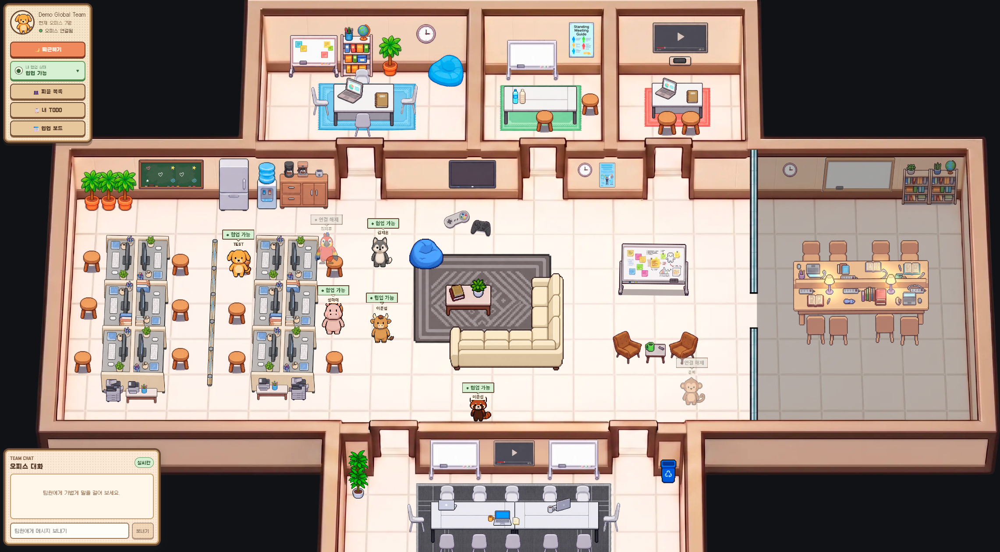
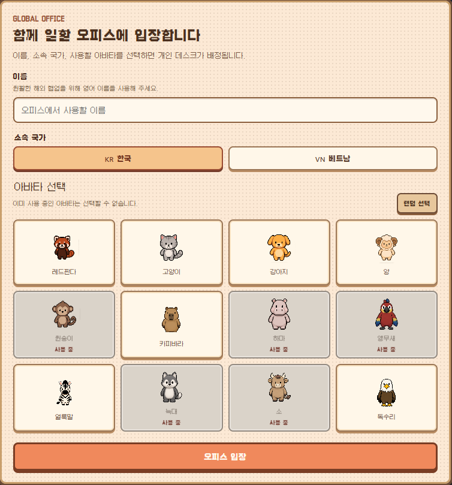
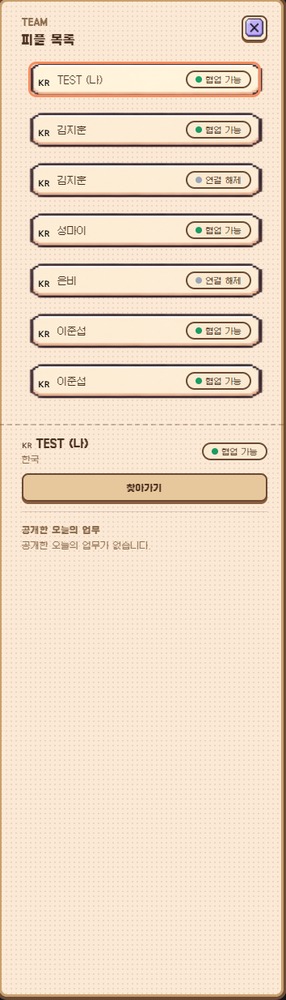
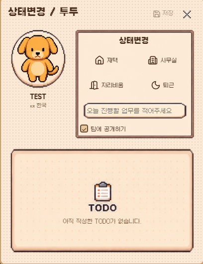
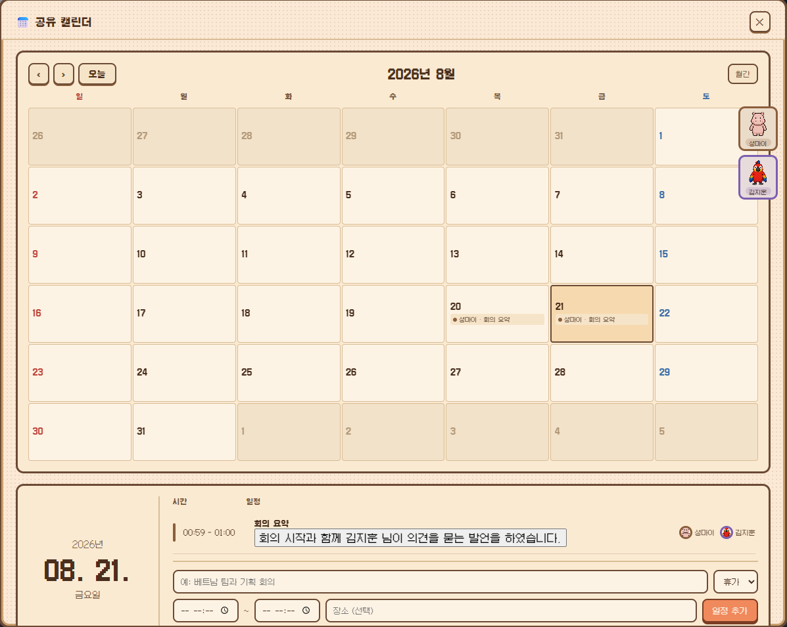

# Zooffice

Zooffice는 한국과 베트남처럼 서로 다른 국가의 팀원이 함께 일할 때 발생하는 업무 상태, 일정, 언어 장벽의 불확실성을 줄이는 AI 기반 가상 협업 오피스입니다.

## 소개

원격 글로벌 협업에서는 상대가 지금 일하는 중인지, 회의 중인지, 자리를 비운 것인지 바로 알기 어렵습니다. 휴가나 재택 일정이 늦게 공유되면 의존 작업이 멈추고, 한국어·베트남어 회의에서는 핵심 결정과 요청 사항이 다르게 이해될 수 있습니다.

Zooffice는 팀원을 감시하는 도구가 아니라, 팀원이 직접 공유한 상태, 오늘의 TODO, 부재 일정, 회의 맥락을 하나의 가상 오피스에서 확인하게 해 다음 행동을 더 빠르게 결정하도록 돕는 서비스입니다.

## 핵심 기능

- 아바타 기반 가상 오피스 입장
- 팀원 상태와 위치 실시간 공유
- 오늘의 TODO 작성 및 공개 TODO 확인
- 휴가, 재택, 회의, 집중 작업을 포함한 팀 공유 캘린더
- 피플 목록, 팀원 검색, 찾아가기, 불러오기
- LiveKit 기반 화상회의
- 한국어·베트남어 회의 자막 표시 흐름
- 오피스 채팅 한국어·베트남어 번역 보조
- 회의 요약 제출 및 캘린더 이벤트 반영

## 현재 구현된 기능

### Virtual Office

- 게스트 이름, 국가, UI 언어, 아바타 선택 후 오피스 입장
- 사용 가능한 아바타 조회와 중복 선택 방지
- Phaser 기반 오피스 맵, 아바타 이동, 충돌 영역 처리
- Socket.IO 기반 접속, 퇴장, 위치, 상태 동기화
- 출근, 퇴근, 협업 가능, 집중 작업, 회의 중, 자리 비움 상태 표시
- 피플 목록에서 팀원 검색, 프로필 확인, 찾아가기, 불러오기 요청
- 오피스 공용 채팅과 한국어·베트남어 번역 fallback

### TODO & Calendar

- 내 TODO 생성, 조회, 수정, 삭제
- 공개 TODO를 통해 팀원의 현재 업무 맥락 확인
- 팀 공유 캘린더 일정 생성, 조회, 수정, 삭제
- 휴가, 부재, 재택, 회의, 집중 작업 일정 유형 지원
- 현재 시간 기준 팀원별 캘린더 상태 조회
- TODO와 캘린더 변경 시 오피스 내 실시간 갱신 이벤트 발행

### Realtime Meeting

- LiveKit 회의 참가 토큰 발급
- 회의실별 LiveKit roomName 분리
- 회의 참가자 비디오·오디오 UI
- 회의 제어 바, 참가자 목록, 회의 채팅
- Socket.IO 기반 회의 자막 구독
- mock subtitle 생성, 목록 조회, 실시간 표시
- LiveKit webhook 수신, 서명 검증, room state 관리
- 회의 요약 제출 후 캘린더 회의 이벤트 생성

### Shared Contract

- Client와 Server가 공유하는 도메인 타입
- HTTP 요청·응답 DTO
- Socket 이벤트 이름과 payload 계약
- 오피스, TODO, 캘린더, 회의, 자막, 채팅 계약 분리

## 기술 스택

### Frontend

- React
- TypeScript
- Vite
- Phaser
- Socket.IO Client
- LiveKit Components
- Zustand
- i18next, react-i18next
- lucide-react

### Backend

- NestJS
- TypeScript
- Socket.IO
- LiveKit Server SDK
- Supabase
- class-validator
- Node.js test runner

### Workspace

- pnpm workspace
- TypeScript shared package
- Client / Server / Shared monorepo 구조

## 프로젝트 구조

```text
apps/client/      React + Phaser 기반 가상 오피스 클라이언트
apps/server/      NestJS API, Socket, LiveKit, Supabase 연동 서버
packages/shared/  공통 타입, DTO, Socket 이벤트 계약
docs/             제품 기획, 기능 문서, 실행 가이드, 협업 기록
```

## 시작하기

```bash
pnpm install
pnpm dev:server
pnpm dev:client
```

Client는 기본적으로 `http://localhost:5173`, Server는 `http://localhost:4000`에서 실행합니다.

자세한 로컬 실행 절차는 [Client 로컬 실행 가이드](docs/RUNBOOKS/client-local.md)와 [Server 로컬 실행 가이드](docs/RUNBOOKS/server-local.md)를 참고합니다.

## 환경 변수

### Client

```env
VITE_SERVER_URL=http://localhost:4000
```

### Server

```env
NODE_ENV=development
PORT=4000
CORS_ORIGINS=http://localhost:5173,http://localhost:3000

LIVEKIT_URL=wss://development-project.livekit.cloud
LIVEKIT_API_KEY=replace-with-development-key
LIVEKIT_API_SECRET=replace-with-development-secret
LIVEKIT_TOKEN_TTL_SECONDS=900

SUPABASE_URL=https://your-project.supabase.co
SUPABASE_SECRET_KEY=replace-with-server-secret-key
OFFICE_WORKSPACE_NAME=LIKELION2026 Global Office
```

오피스 채팅 자동 번역은 선택 기능입니다. 설정하지 않으면 서버는 짧은 데모 phrasebook fallback을 사용합니다.

```env
OFFICE_CHAT_TRANSLATION_PROVIDER=gemini
OFFICE_CHAT_GEMINI_API_KEY=replace-with-gemini-key
OFFICE_CHAT_TRANSLATION_MODEL=gemini-3.1-flash-lite
OFFICE_CHAT_TRANSLATION_TIMEOUT_MS=10000
```

## 주요 명령어

```bash
pnpm typecheck
pnpm build
pnpm test:server
pnpm smoke:meeting-subtitle
pnpm smoke:livekit-room
pnpm smoke:livekit-webhook
```

## 데모 시나리오

1. 사용자는 UI 언어를 선택하고 이름, 국가, 아바타를 설정해 Global Office에 입장합니다.
2. 피플 목록에서 팀원을 검색하고 현재 상태와 공개 TODO를 확인합니다.
3. 공유 캘린더에서 휴가, 회의, 재택 등 협업에 영향을 주는 일정을 확인합니다.
4. 찾아가기 또는 불러오기로 팀원과 대화 진입점을 만듭니다.
5. 회의실에 입장해 LiveKit 회의에 연결하고 한국어·베트남어 자막 흐름을 확인합니다.
6. 회의 요약을 제출하면 캘린더의 회의 이벤트로 남습니다.

## 화면

### Global Office



### 주요 UI

| 언어 선택 | 입장 정보와 아바타 선택 |
| --- | --- |
|  |  |

| 피플 목록 | 찾아가기와 불러오기 |
| --- | --- |
|  |  |

| 상태 변경과 TODO | 공유 캘린더 |
| --- | --- |
|  |  |

| 오피스 대화 |
| --- |
|  |

## 주요 문서
- [Figma 디자인 시안](https://www.figma.com/design/XNMBF9IXkhkotGr6EoiW4J/LIKELION2026?node-id=0-1&t=YCqArq9kmUsJeycy-1)
- [Notion 팀 워크스페이스](https://rainbow-board-5a0.notion.site/3a63fc0908698096be0aca667596e18e)
- [PRD](docs/PRD.md)
- [프로젝트 구조](docs/STRUCTURE.md)
- [작업 규칙](docs/CONVENTIONS.md)
- [Client 로컬 실행](docs/RUNBOOKS/client-local.md)
- [Server 로컬 실행](docs/RUNBOOKS/server-local.md)
- [실시간 회의 기능 문서](docs/FEATURES/realtime-meeting/README.md)
- [가상 오피스 기능 문서](docs/FEATURES/virtual-office/user-scenarios.md)
- [AI Agent 작업 기록](docs/AI_AGENT_WORKFLOW.md)

## 향후 계획

- 실제 STT·번역 파이프라인과 회의 자막 연결 강화
- AI 회의 요약의 사용자 검토·수정 흐름 고도화
- TODO 초안 생성과 일정 충돌 알림
- 한국어·베트남어 문구 원어민 검수
- 파일럿 팀 대상 사용성 검증과 협업 지표 수집
