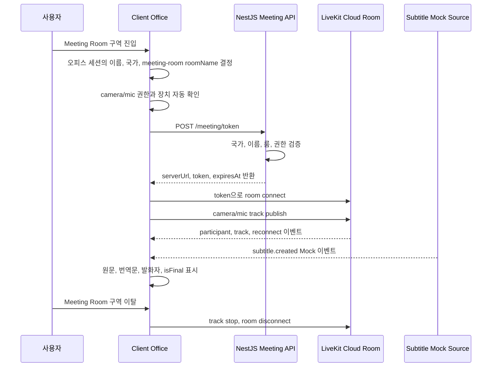

# Realtime Meeting Pipeline

> 작성자: Codex
>
> 작성일: 2026-08-15
>
> 마지막 업데이트: 2026-08-19
>
> 상태: P0 설계
>
> 관련 Issue / PR / Discussion: https://github.com/LIKELION2026/LIKELION2026/issues/6, https://github.com/LIKELION2026/LIKELION2026/issues/131

## 목적

LiveKit Cloud 기반 회의 입장, 영상·음성 송수신, 자막 Mock 표시까지의 P0 파이프라인을 정의한다. 2026-08-19부터 실제 사용자 진입은 `/meeting-lab` 페이지 이동이 아니라 `/office`의 Meeting Room 구역 진입을 기준으로 한다. `/meeting-lab`은 같은 세션 컨트롤러를 검증하는 회귀 확인용 화면으로 유지한다.

## 범위

### P0 포함

- LiveKit Cloud 프로젝트를 사용한 1:1 또는 소규모 회의방 입장
- Server의 짧은 TTL LiveKit room join token 발급
- Client Meeting Lab의 기기 사전 확인, 입장, 퇴장, mic/camera 제어
- Office Meeting Room 구역 진입·이탈과 LiveKit room 생명주기 연결
- 원격 참가자 audio/video track 렌더링
- `subtitle.created` Mock 이벤트를 통한 원문·번역 자막 UI 검증
- 권한 거부, 연결 실패, 재연결, 회의 종료 상태 처리

### P0 제외

- 실제 STT/ASR provider 연결
- Translation Agent의 LiveKit room 참가
- LLM 기반 문맥 보정 번역
- Meeting AI의 action item, decision, assignee, deadline 추출
- 녹화 원본, 장기 transcript 저장, 자동 업무 배정

## 한눈에 보는 흐름



## 책임 경계

| 영역 | 책임 |
| --- | --- |
| Client | 기기 권한 확인, LiveKit room 연결, local/remote media 렌더링, 회의 상태 UI, 자막 Mock 표시 |
| Server | P0 임시 참가자 정책 검증, 룸 접근 권한 검증, LiveKit token 발급, API secret 보관 |
| Shared | `CreateMeetingTokenRequest`, `CreateMeetingTokenResponse`, `MeetingRoomStateResponse`, `CreateMockSubtitleRequest`, `CreateMockSubtitleResponse`, `ListMockSubtitlesResponse`, `subtitle.created` payload 계약 |
| LiveKit Cloud | WebRTC signaling, SFU media routing, reconnect, 참가자·track 이벤트 전달 |
| Subtitle Mock Source | 실제 STT 전까지 자막 UI와 Socket 계약을 검증하는 개발용 입력 |

## 상세 파이프라인

### 1. 입장 전 기기 확인

Client는 사용자가 회의에 들어가기 전에 camera/mic 권한과 장치 목록을 확인한다. 권한이 거부되면 회의 입장 버튼을 막거나, audio-only 입장처럼 허용 가능한 대체 경로를 명확히 표시한다.

확인할 상태:

- `idle`: 아직 권한 확인 전
- `checking`: 장치와 권한 확인 중
- `ready`: 입장 가능
- `permission-denied`: 권한 거부
- `device-unavailable`: 사용 가능한 장치 없음

### 2. 토큰 발급

Client는 LiveKit API key나 secret을 직접 알지 않는다. 회의 입장 시 Server의 `POST /meeting/token`만 호출한다.

요청에 포함할 값:

- `roomName`
- `participantName`
- `participantCountry`

Server에서 검증할 값:

- P0에서는 인증 모듈이 붙기 전이므로 `lab-<team>-<yyyymmdd>-<slug>` 형식의 Meeting Lab room만 허용한다.
- `participantCountry`는 `kr` 또는 `vn`만 허용한다.
- P0에서는 로그인 없이 사용자 표시 이름만 받으므로 Client가 `participantIdentity`를 보내지 않는다.
- Server는 `participantCountry`에 따라 `kr-guest-<uuid>` 또는 `vn-guest-<uuid>` LiveKit identity를 발급한다.
- Server는 `participantCountry`에 따라 `preferredLanguage`를 `kr -> ko`, `vn -> vi`로 파생한다.
- `participantName`, `participantCountry`, `roomName`은 앞뒤 공백을 제거한 뒤 검증한다.
- LiveKit grant는 room join, subscribe, camera/microphone publish, data publish만 허용한다.

응답에 포함할 값:

- `serverUrl`
- `token`
- `roomName`
- `participantIdentity`
- `participantName`
- `participantCountry`
- `preferredLanguage`
- `expiresAt`

보안 원칙:

- `LIVEKIT_API_SECRET`은 Server 환경변수로만 읽는다.
- token TTL은 짧게 유지한다. 현재 기본값은 900초를 사용한다.
- token, API key, API secret은 로그에 남기지 않는다.
- Client에는 LiveKit Cloud 접속 URL과 join token만 전달한다.
- `LIVEKIT_URL`은 `wss://`로 시작하는 LiveKit Cloud URL만 허용한다.
- LiveKit token attributes에는 `roomName`, `participantCountry`, `preferredLanguage`만 넣고 로그인 사용자 ID는 넣지 않는다.

### 3. LiveKit room 연결

Client는 Server 응답의 `serverUrl`과 `token`으로 LiveKit room에 연결한다. 첫 참가자가 입장할 때 room이 자동 생성될 수 있으므로 P0에서는 별도 room create API를 강제하지 않는다.

Client가 처리할 이벤트:

- 연결 중
- 연결 완료
- 재연결 중
- 재연결 완료
- 연결 실패
- 참가자 입장·퇴장
- local/remote track publish·unpublish
- 회의 종료

회의 종료 시 처리:

- local camera/mic track stop
- room disconnect
- 화면 상태 초기화
- 남은 listener와 timer 정리

### 3-1. Office Meeting Room 생명주기

`/office`에서는 Phaser `OfficeScene`이 Meeting Room 경계 진입·이탈을 edge-trigger 이벤트로 전달한다. Client는 이 이벤트를 `idle → requesting-permission → connecting → connected → leaving → failed` 상태 전이로 다루며, 같은 구역 안에서 매 프레임 토큰 요청이나 LiveKit room 생성을 반복하지 않는다.

진입 시 처리:

- 오피스 세션의 `member.name`과 `countryCode`를 회의 참가자 이름·국가로 변환한다.
- `meeting-room-section`의 `lab-likelion-<yyyymmdd>-meeting-room` roomName 생성 규칙을 재사용한다.
- `getUserMedia({ audio: true, video: true })`로 권한과 장치를 확인하고, 확인용 임시 stream은 즉시 stop한다.
- 권한이 준비되면 `POST /meeting/token`을 호출하고 LiveKit room에 연결한다.
- LiveKit 연결이 성공한 뒤에만 오피스 Presence를 `in_meeting`으로 전환한다.

이탈·취소 시 처리:

- 진행 중인 token fetch를 `AbortController`로 취소한다.
- LiveKit room listener를 제거하고 `disconnect(true)`로 local track을 정리한다.
- 자막 Socket 구독은 roomName이 사라지는 시점에 unsubscribe하고 disconnect한다.
- 연결 실패, 명시적 이탈, 컴포넌트 unmount, `pagehide`에서는 이전 수동 Presence 상태로 복구한다.
- 빠른 재진입에서도 현재 시도 번호가 지난 비동기 결과는 무시한다.

### 4. 자막 Mock 흐름

실제 STT/번역 Agent가 붙기 전까지는 자막 Mock 입력으로 화면과 계약을 검증한다. Mock은 실제 번역 품질을 검증하지 않고, 회의 화면이 자막 이벤트를 안정적으로 표시하는지만 확인한다.

사용 계약:

```ts
interface SubtitleCreatedPayload {
  subtitleId: string;
  roomName: string;
  speaker: {
    participantIdentity: string;
    displayName: string;
  };
  sourceLanguage: LanguageCode;
  sourceText: string;
  translatedLanguage: LanguageCode;
  translatedText: string;
  occurredAt: string;
  isFinal: boolean;
  revision: number;
  confidence?: number;
}
```

표시 기준:

- `subtitleId`는 한 발화 세그먼트의 안정적인 ID로 사용한다.
- `isFinal: false`는 임시 자막으로 표시하고, 같은 `subtitleId`의 새 이벤트가 오면 교체한다.
- `isFinal: true`는 확정 자막으로 표시한다.
- `revision`은 같은 `subtitleId` 안에서 1부터 증가한다. Client는 더 낮은 `revision`의 늦게 도착한 이벤트를 무시한다.
- 원문과 번역문을 함께 보여 준다.
- 번역이 확정적이지 않을 수 있음을 자막 UI에서 인지할 수 있게 한다.

### 5. 후속 Agent 연결 지점

후속 단계에서 Translation Agent를 붙이면 `Subtitle Mock Source`가 Agent로 교체된다. Agent는 LiveKit room에 programmatic participant로 참가해 참가자 audio track을 구독하고, STT와 번역 결과를 자막 이벤트로 발행한다.

후속 단계에서 추가할 책임:

- audio track별 STT streaming
- partial transcript와 final transcript 구분
- 빠른 임시 번역과 stable chunk 기반 보정 번역 분리
- final transcript 저장
- Meeting AI 입력용 확정 transcript 전달

P0에서는 이 책임을 구현하지 않는다. 단, `subtitleId`, `revision`, `speaker`, `sourceLanguage`, `translatedLanguage`, `isFinal` 필드는 후속 Agent가 그대로 사용할 수 있게 유지한다. 별도 `segmentId`는 P0에서 추가하지 않고, STT provider 연결 시 provider-native segment id가 필요해지면 확장한다.

## 오류 상태

| 상황 | 사용자에게 보여 줄 상태 | 구현 기준 |
| --- | --- | --- |
| camera/mic 권한 거부 | 권한을 허용해야 회의에 참여할 수 있음 | 브라우저 권한 안내와 재시도 제공 |
| 장치 없음 | 사용할 수 있는 장치 없음 | audio-only 또는 재확인 경로 제공 여부 결정 |
| token API 실패 | 회의 입장 정보를 받을 수 없음 | 4xx/5xx에 따라 권한 문제와 서버 문제를 분리 |
| LiveKit 연결 실패 | 회의방 연결 실패 | 재시도 버튼과 오류 원인 표시 |
| 재연결 중 | 네트워크 재연결 중 | media UI를 유지하고 상태 배지 표시 |
| 자막 Mock 없음 | 아직 자막 없음 | 빈 상태 표시 |
| 회의 종료 | 회의가 종료됨 | track과 listener 정리 후 입장 화면으로 복귀 |

## 구현 체크리스트

### Shared

- mock subtitle request/response 타입을 Client와 Server에서 함께 사용
- mock subtitle list response 타입을 Client와 Server에서 함께 사용
- `subtitle.created` 이벤트 이름 상수 확정 완료
- `meeting.room.subscribe` / `meeting.room.unsubscribe` room subscription 이벤트 계약 확정 완료
- `SubtitleCreatedPayload`는 `subtitleId`를 segment grouping key로 사용
- partial/final 갱신은 같은 `subtitleId`와 증가하는 `revision`으로 처리
- `SocketEventPayloadMap`으로 이벤트 이름과 payload 타입 연결
- token request/response 타입을 Client와 Server에서 함께 사용
- room state response 타입을 Client와 Server에서 함께 사용

### Server

- Mock subtitle source API: `POST /meeting/subtitles/mock` returns a `subtitle.created` payload from shared contracts and emits it through the `/meeting` Socket namespace
- Mock subtitle Socket gateway: clients subscribe with `meeting.room.subscribe`; server emits `subtitle.created` to subscribers of the payload room
- Mock subtitle buffer API: `GET /meeting/rooms/:roomName/subtitles` returns the latest in-memory subtitle payload per `subtitleId` for valid lab rooms
- Meeting cleanup: `room_finished` webhook clears participants and the room's in-memory mock subtitle buffer
- `POST /meeting/token` 인증 연결
- P0 room 정책: `lab-<team>-<yyyymmdd>-<slug>`
- P0 participant policy: Client sends only `participantName` and `participantCountry`; Server derives `participantIdentity` and `preferredLanguage`
- LiveKit grant 정책: room join, subscribe, camera/microphone publish, data publish
- token TTL과 환경변수 검증 문서화
- token/API secret 로그 마스킹 확인
- LiveKit webhook endpoint: `POST /meeting/livekit/webhook`
- Webhook body parser: raw body preservation enabled for `application/webhook+json`
- Webhook auth: LiveKit SDK signature/hash verification before ACK
- Webhook P0 behavior: verified events update an in-memory room state snapshot; persistence, transcript linkage, and AI Agent handoff remain follow-up work
- Webhook idempotency: duplicate LiveKit event IDs are acknowledged without reapplying room state changes
- Webhook smoke: signed local webhook smoke verifies ACK and duplicate handling before public LiveKit Cloud testing
- Room state API: `GET /meeting/rooms/:roomName/state` returns the in-memory room snapshot for valid lab rooms and 404s unknown rooms
- Public webhook smoke target: non-local `LIVEKIT_WEBHOOK_SMOKE_URL` must use `https://`
- LiveKit Cloud room lifecycle smoke: `pnpm smoke:livekit-room` creates and deletes a Cloud room through `RoomServiceClient`, then polls room state for `room_started` and `room_finished`

### Client

- `apps/client` 초기 구조 생성
- Meeting Lab 라우트 추가
- 로그인 없는 참가자 프로필(`displayName`, `participantCountry`) 저장과 재사용
- 현재 오피스 섹션에서 Meeting Lab roomName 파생
- device preflight UI 구현
- LiveKit room 연결과 media 렌더링 구현
- mic/camera toggle 구현
- 연결 상태와 오류 상태 구현
- 자막 Mock 이벤트 표시 구현

### Verification

- 두 브라우저가 같은 `lab-<name>-<date>` 룸에 입장한다.
- local/remote video와 audio가 표시된다.
- mic/camera toggle이 track 상태에 반영된다.
- 권한 거부와 연결 실패가 사용자에게 표시된다.
- `subtitle.created` Mock 이벤트가 원문·번역문·발화자·시각·확정 여부로 표시된다.
- 회의 종료 후 camera/mic 사용이 정리된다.
- Signed webhook smoke returns `duplicate: false` for the first event and `duplicate: true` for the repeated event ID.
- Signed webhook smoke queries `GET /meeting/rooms/:roomName/state` and verifies the webhook-updated participant snapshot.
- Public webhook smoke rejects non-local `http://` target URLs before sending a request.
- LiveKit Cloud room lifecycle smoke observes `room_started` as `active` and `room_finished` as `finished` through the webhook-backed room state API.
- Mock subtitle API returns `eventName: "subtitle.created"` with a valid partial/final subtitle payload.
- Mock subtitle Socket gateway joins/leaves room subscriptions and emits `subtitle.created` to the room-scoped Socket.IO room.
- Mock subtitle buffer keeps the highest `revision` for each `subtitleId` and returns an empty list for valid rooms without subtitles.
- `room_finished` webhook clears the room's mock subtitle buffer.
- Token API accepts only `participantName` and `participantCountry` for participant input, then returns the server-derived `participantIdentity` and `preferredLanguage`.
- Manual token API smoke verifies `kr -> ko` with `kr-guest-<uuid>` and `vn -> vi` with `vn-guest-<uuid>`.
- Client token request smoke uses a section-derived room name such as `lab-likelion-<yyyymmdd>-meeting-room`.
- `pnpm smoke:meeting-subtitle` posts partial/final Mock subtitle payloads to a running server and verifies that the room buffer keeps the final highest-revision subtitle.
- Meeting Lab P0 demo verifies two browser sessions in the same section-derived room, local/remote media rendering, mic/camera toggles, Mock subtitle display, and disconnect cleanup.

## 오픈 질문

- 인증이 붙은 뒤에는 로그인 사용자 ID와 P0 임시 `participantIdentity`를 어떻게 매핑할지 별도 migration 정책이 필요하다.
- 자막 Mock은 P0에서 Server mock API와 `/meeting` Socket gateway emission으로 시작한다. Client의 실제 표시 UX는 Client 연결 단계에서 확정한다.

## 참고 자료

- [LiveKit Access Tokens and Grants](https://docs.livekit.io/frontends/reference/tokens-grants/)
- [LiveKit Endpoint Token Generation](https://docs.livekit.io/frontends/build/authentication/endpoint/)
- [LiveKit JavaScript Server SDK](https://docs.livekit.io/reference/server-sdk-js/)
- [LiveKit Text Streams](https://docs.livekit.io/transport/data/text-streams/)
