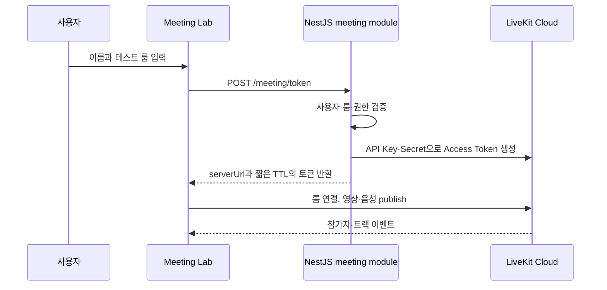

# Realtime Meeting

> 작성자: Project Team
>
> 작성일: 2026-08-15
>
> 마지막 업데이트: 2026-08-19
>
> 상태: 구현 진행
>
> 관련 Issue / PR / Discussion: https://github.com/LIKELION2026/LIKELION2026/issues/6, https://github.com/LIKELION2026/LIKELION2026/issues/133, https://github.com/LIKELION2026/LIKELION2026/issues/134

## 해결하려는 문제

서로 다른 언어를 쓰는 팀원이 화상회의에서 발언을 즉시 이해하지 못해, 결정과 요청을 다시 확인하는 문제를 줄인다.

## MVP 범위

- 1:1 또는 소규모 회의방 입장·퇴장
- 로컬·상대 참가자의 영상과 음성 표시
- 카메라·마이크 권한, 연결 중, 연결 실패 상태 표시
- 한국어·베트남어 자막 UI
- 실제 음성 인식 전 자막 이벤트 Mock으로 화면과 Socket 계약 검증

회의 요약, 장기 녹화 저장, 자동 업무 배정은 이 기능의 초기 범위에서 제외한다.

## Meeting Lab

메인 Phaser 오피스와 분리된 `Meeting Lab` 화면에서 LiveKit 연결과 자막 UI를 먼저 검증한다. 검증된 회의 컴포넌트와 계약만 메인 오피스의 회의실 진입 흐름에 연결한다.

```text
apps/client/src/
└── pages/
    └── meeting-lab/
        ├── MeetingLabPage.tsx       # 이름·테스트 룸 입력과 진입
        ├── DevicePreflight.tsx      # 카메라·마이크 권한 확인
        ├── MeetingRoom.tsx          # LiveKit 연결과 영상·음성 화면
        └── SubtitleSandbox.tsx      # 자막 Mock 및 이벤트 표시
```

`Meeting Lab`은 별도 배포 서비스가 아니다. 메인 Client 내부의 개발·데모 전용 경로로 두어, 실제 Client 환경·Shared 타입·Server 토큰 API를 그대로 검증한다.

## 연결 흐름

P0 파이프라인의 책임 경계, 오류 상태, 후속 Agent 연결 지점은 [Realtime Meeting Pipeline](./PIPELINE.md)을 따른다.



## Client 구현 기준

- `realtime-meeting` 기능 안에서 LiveKit 연결 상태와 UI를 관리한다.
- Lab 페이지는 테스트 진입점이고, 회의 컴포넌트는 메인 오피스에서도 재사용할 수 있게 `features/realtime-meeting`에 둔다.
- 첫 PoC에서는 `LiveKitRoom`을 사용할 수 있다. 메인 앱 상태와 연결 생명주기를 세밀하게 제어해야 하면 `RoomContext.Provider`와 `Room` 인스턴스를 직접 관리한다.
- 자막 UI는 실제 음성 인식이 없어도 `subtitle.created` Mock 이벤트를 받아 원문·번역문·발화자·시각을 표시할 수 있어야 한다.
- 권한 거부, 연결 중, 재연결, 연결 실패 상태를 별도 화면 상태로 처리한다.

## 세션 채팅 정책

- 인게임 회의 우측 패널의 일반 채팅은 LiveKit Text Stream을 사용한다.
- 오피스 세션이 있는 사용자는 `session.member.id`를 LiveKit `participantIdentity`로 사용한다. 재연결, 포커스 복귀, 개발 모드 중복 effect에서도 같은 사용자가 새 게스트 참가자로 보이는 일을 줄이기 위한 정책이다.
- Text Stream topic은 Client 상수 `meeting.chat`으로 고정한다.
- 메시지 발신자 식별자는 사용자가 보낸 본문이 아니라 LiveKit handler의 `participantInfo.identity`를 기준으로 판단한다.
- 사용자가 직접 입력한 메시지는 원문 그대로 전송하며, 공백 메시지와 500자 초과 메시지는 전송하지 않는다.
- 로컬 메시지는 즉시 `sending` 상태로 표시하고, LiveKit stream id 또는 local echo가 도착하면 `sent` 상태로 병합한다.
- 전송 실패 메시지는 사라지지 않고, 사용자가 재시도하거나 삭제할 수 있다.
- 세션 채팅은 현재 회의 참가자에게만 전달되는 비영속 메시지다. DB 저장과 이전 회의 내역 복원은 후속 범위로 둔다.
- UI 메모리 보호 상한은 최근 5,000개 메시지다. 1시간 회의에서 일반 채팅과 AI 번역 메시지가 함께 들어오는 상황을 고려해, 기존 100개 제한보다 크게 잡는다.
- AI 번역 메시지는 일반 사용자 메시지로 위장하지 않고 `translation` kind와 `AI 번역` 라벨로 구분한다. 번역 ON 상태에서만 자막 Socket을 구독하고, 켠 시각(`activatedAt`) 이후 payload만 채팅 타임라인에 병합한다. 원문은 별도 `sourceText`로 보존한다.
- 재연결 중에는 이번 MVP에서 입력을 비활성화한다. 로컬 대기열 전송은 후속 안정화 범위로 둔다.

## AI 번역 ON/OFF 정책

- AI 번역은 기본 ON이다.
- OFF 상태에서 하단 `Globe` 버튼을 눌러 다시 ON으로 바꾸면 언어 설정 모달을 먼저 띄운다.
- MVP 지원 언어는 `ko`, `vi`만 허용한다.
- UI 옵션은 `KR`, `VI`로 표시하고, 내부 언어 코드는 각각 `ko`, `vi`를 사용한다.
- `나의 언어`와 `상대방에게 보여줄 언어`는 서로 달라야 한다.
- 저장 성공 전에는 UI를 ON으로 바꾸지 않는다. Client는 LiveKit participant attributes 업데이트가 성공한 뒤에만 `enabled: true`와 `activatedAt`을 반영한다.
- OFF로 끄면 일반 채팅은 유지하지만 AI 번역 자막/채팅은 더 이상 표시하지 않는다.
- OFF 중 생성된 번역 payload는 나중에 다시 ON으로 켜도 소급 표시하지 않는다.
- 저장한 언어 선택은 다음 회의 진입의 기본값으로 재사용한다.
- 회의 토큰 요청에도 저장한 언어 선택을 포함해 LiveKit participant attributes와 Client UI가 같은 기본값으로 시작한다.
- 번역 payload가 아직 없을 때는 하단 caption 영역에 `AI 번역 연결 중`, `AI 번역 대기 중`, `AI 번역 연결 실패` 중 하나를 표시한다. 현재 Client는 자막 Socket 상태만 알 수 있으므로, Translation Agent worker의 실제 가동 여부는 별도 heartbeat가 붙기 전까지 `대기 중`과 구분하지 않는다.
- LiveKit participant attributes 키는 `preferredLanguage`, `translationTargetLanguage`, `translationReceivingEnabled`를 사용한다.

## Server 구현 기준

- `apps/server/src/modules/meeting`이 회의방 메타데이터와 토큰 발급 요청을 담당한다.
- LiveKit SDK 접근과 토큰 생성 세부 구현은 `apps/server/src/integrations/livekit`에 둔다.
- 토큰 API는 인증된 사용자와 허용된 룸 이름만 받는다.
- 토큰은 짧은 TTL을 사용하고, API Key와 Secret은 응답·로그·Client 번들에 포함하지 않는다.
- 토큰 attributes에는 참가자의 기본 말하기 언어와 번역 수신 상태를 포함한다. 기본값은 `translationReceivingEnabled: "true"`다.
- Client가 모달 저장 후 자신의 번역 attributes를 갱신할 수 있도록 LiveKit grant에 `canUpdateOwnMetadata`를 포함한다.
- 룸은 첫 참가자가 연결될 때 생성될 수 있으므로, MVP에서는 별도 룸 생성 API를 강제하지 않는다.

## 환경변수

개발용 LiveKit 프로젝트를 운영 환경과 분리한다. 값은 Git에 커밋하지 않는다.

```env
# apps/server/.env.local
LIVEKIT_URL=wss://<development-project>.livekit.cloud
LIVEKIT_API_KEY=
LIVEKIT_API_SECRET=
```

Client에는 공개 가능한 LiveKit 서버 URL만 전달한다. `LIVEKIT_API_SECRET`은 Server에서만 읽는다.

## 테스트 시나리오

| 시나리오 | 확인할 결과 |
| --- | --- |
| 기기 사전 확인 | 카메라·마이크 권한 상태와 선택한 장치를 사용자가 확인한다. |
| 두 사용자 입장 | 두 브라우저 창 또는 두 팀원이 같은 `lab-*` 룸에서 영상·음성을 주고받는다. |
| 권한 거부 | 사용자가 권한을 거부해도 원인과 재시도 방법을 확인한다. |
| 연결 실패 | 잘못된 토큰·서버 URL·네트워크 오류에서 연결 중 상태가 멈추지 않는다. |
| 자막 Mock | `subtitle.created` 이벤트로 원문과 번역문이 올바른 순서로 표시된다. |
| 회의 종료 | 퇴장 후 카메라·마이크 트랙과 룸 연결이 정리된다. |

테스트 룸 이름은 `lab-<team-member>-<date>` 형식을 사용해 데모·개발 룸과 구분한다.

## 완료 기준

- Client가 Server 토큰 API를 통해 LiveKit 연결 정보를 받는다.
- 두 사용자가 같은 테스트 룸에 입장해 영상·음성을 확인한다.
- 권한·연결 오류가 사용자에게 명확히 표시된다.
- 자막 Mock 이벤트가 Shared 계약을 통해 화면에 표시된다.
- 메인 오피스는 Meeting Lab의 검증된 회의 컴포넌트를 호출할 수 있는 구조를 가진다.

## 참고 자료

- [Realtime Meeting Pipeline](./PIPELINE.md)
- [LiveKit React Room Context](https://docs.livekit.io/reference/components/react/concepts/livekit-room-component/)
- [LiveKit Access Tokens and Grants](https://docs.livekit.io/frontends/reference/tokens-grants/)
- [LiveKit JavaScript Server SDK](https://docs.livekit.io/reference/server-sdk-js/)
- [LiveKit Authentication](https://docs.livekit.io/frontends/build/authentication/)
