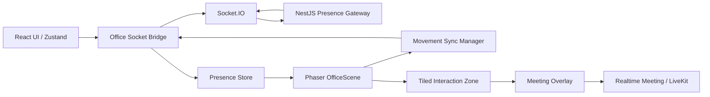

# Virtual Office

> 작성자: Project Team
>
> 작성일: 2026-08-15
>
> 마지막 업데이트: 2026-08-15
>
> 상태: 구현 전 계획
>
> 관련 Issue / PR / Discussion: GitHub Project의 `Phaser 2D 가상 오피스 구조 구축` Draft Item 연결 예정

## 해결하려는 문제

원격으로 협업하는 팀원은 서로가 지금 어떤 업무 맥락에 있는지, 회의 가능한지, 응답을 기다려야 하는지 빠르게 파악하기 어렵다. Virtual Office는 팀원의 현재 상태와 상호작용 가능한 공간을 공유해, 불필요한 확인과 신뢰 저하를 줄인다.

## MVP 범위

- 브라우저에서 접속 가능한 하나의 2D 픽셀 오피스
- 내 아바타 이동, 카메라 추적, 가구 및 벽 충돌
- 같은 오피스에 접속한 팀원의 입장, 퇴장, 위치, 이동 방향 동기화
- 아바타 위 이름과 상태 표시: `working`, `meeting`, `away`, `focused`
- Tiled 맵의 회의실 영역 감지와 회의 참여 UI 진입점
- LiveKit 회의 기능과 연결할 수 있는 `meeting-room` 상호작용 계약

## MVP 제외 범위

- 근무 시간 또는 생산성 감시와 자동 평가
- 복수 오피스, 개인 공간, 자동 길찾기
- 실제 캘린더 분석을 통한 AI 상태 확정
- Phaser 안에서 영상·음성 스트림을 직접 렌더링하는 방식

## 구조 원칙

Phaser는 화면 렌더링과 입력 처리만 담당한다. Socket 연결, 팀원 상태, 회의 UI와 LiveKit 연결은 React 및 Server 경계에서 관리한다.



### 책임 경계

| 영역 | 담당 책임 | 넣지 않는 책임 |
| --- | --- | --- |
| `OfficeScene` | 맵, 충돌, 내 아바타 입력, 원격 아바타 표시, 영역 감지 | 인증, API 호출, LiveKit 토큰 발급 |
| `OfficeSocketBridge` | Socket 연결, 이벤트 등록·해제, 상태 저장소 갱신 | Phaser Sprite 직접 생성 |
| `Presence Store` | 팀원 스냅샷, 상태, 원격 좌표 목표값 | 매 프레임 React 렌더링 |
| `MeetingOverlay` | 회의 참여 UI, 회의 상태, 자막 UI 호출 | 타일 충돌, 아바타 이동 |
| Server Presence Gateway | 인증된 접속자 기준 룸 검증 및 이벤트 중계 | Client가 보낸 사용자 식별자를 신뢰 |

## 사용자 흐름

1. 사용자가 팀 오피스에 접속한다.
2. Client는 `office:join`으로 팀 오피스 상태 스냅샷을 받는다.
3. Phaser는 내 아바타와 같은 오피스의 원격 아바타를 표시한다.
4. 사용자가 이동하면 위치·방향·애니메이션 상태가 제한된 빈도로 공유된다.
5. 사용자가 회의실 영역에 들어가면 `meeting-room` 상호작용 UI가 열린다.
6. 사용자가 참여를 선택하면 Realtime Meeting 기능이 LiveKit 토큰을 요청하고 회의를 연다.
7. 카메라·마이크·회의 상태 변경은 아바타 상태 표시에도 반영된다.

## 구현 단계

### Phase 1 - 정적 오피스와 로컬 아바타

- Tiled `.tmj` 맵과 타일셋 로드
- `Collision` 레이어 물리 충돌 적용
- `Spawn` 오브젝트에서 로컬 아바타 생성
- 4방향 idle/walk 애니메이션과 카메라 추적

완료 기준: 한 사용자가 벽과 가구를 통과하지 않고 오피스를 이동할 수 있다.

### Phase 2 - 팀원 Presence 동기화

- Socket Provider 하나를 앱 최상단에서 생성
- 입장 시 전체 스냅샷, 이후 입장·퇴장·이동·상태 이벤트 처리
- 원격 아바타는 `memberId` 기준 `Map`으로 생성·갱신·제거
- 이동 좌표는 상태 저장소에 저장하고 Phaser가 목표 좌표로 보간

완료 기준: 두 브라우저에서 각 사용자의 입장·퇴장·이동이 끊기지 않고 보인다.

### Phase 3 - 상태와 공간 상호작용

- 아바타 위 이름, 상태 아이콘, 회의 중 표시
- `Interactions` Object Layer의 `meeting-room`, `desk`, `lounge` 판정
- 회의실 진입 시 Meeting Overlay를 열 수 있는 이벤트 발행

완료 기준: 사용자는 다른 팀원의 상태와 회의실 진입 가능 여부를 한눈에 알 수 있다.

### Phase 4 - Realtime Meeting 연결

- Meeting Overlay에서 Realtime Meeting의 검증된 컴포넌트 호출
- 전체화면 회의 중 Phaser 입력 비활성화
- 회의 종료 후 오피스와 입력 상태 복구

완료 기준: 회의실에서 사용자의 명시적 참여 동작 후 LiveKit 회의에 연결된다.

## 맵 및 에셋 규칙

```text
apps/client/public/assets/
├── maps/
│   └── office.tmj
├── tiles/
└── avatars/
```

| 이름 | 타입 | 규칙 |
| --- | --- | --- |
| `Ground` | Tile Layer | 바닥 타일 |
| `Furniture` | Tile Layer | 책상, 의자, 벽을 포함한 전경 타일 |
| `Collision` | Tile Layer | `collides=true` 타일만 사용, 화면에는 숨김 |
| `Interactions` | Object Layer | 아래 상호작용 속성 사용 |
| `Spawn` | Object Layer | 최초 입장 위치, `id=default` 사용 |

`Interactions` Object Layer의 필수 속성은 아래와 같다.

```text
kind = meeting-room | desk | lounge
id = unique-zone-id
label = 사용자에게 보일 이름
```

회의실에는 `kind=meeting-room`과 `meetingRoomId`를 추가한다. `meetingRoomId`는 LiveKit 룸 이름을 직접 만들지 않고, Server가 팀·권한을 검증할 때 사용하는 식별자다.

## Socket 동기화 기준

- Socket은 React `OfficeSocketBridge`에서 한 번만 생성한다.
- Phaser Scene은 Socket event listener를 직접 등록하지 않는다.
- 로컬 이동은 변화가 있을 때만 전송하고, 최대 초당 10~15회로 제한한다.
- 원격 아바타는 수신 좌표를 즉시 점프시키지 않고 짧은 보간으로 이동한다.
- Server는 인증된 사용자와 현재 `officeId`를 기준으로만 이벤트를 중계한다.
- 이벤트의 상세 입력·출력은 [contracts.md](contracts.md)를 기준으로 한다.

## 디자인 핸드오프

디자인 팀이 준비해야 할 장면, 상태, Figma 산출물, Phaser 에셋 전달 기준은 [design-handoff.md](design-handoff.md)를 따른다.

## 학습 기록

Phaser, 실시간 상태 동기화, Tiled 맵, 화상회의 연결을 조사하며 확인한 내용과 다음 검증 항목은 [learning-log.md](learning-log.md)에 남긴다.

## 검증 시나리오

| 시나리오 | 확인 결과 |
| --- | --- |
| 최초 접속 | 현재 오피스 팀원과 내 아바타가 모두 표시된다. |
| 두 사용자 이동 | 상대가 부드럽게 이동하고 좌표가 역전되거나 중복 생성되지 않는다. |
| 새로고침과 재접속 | 이전 아바타가 남지 않고 최신 스냅샷으로 복구된다. |
| 상태 변경 | 상태가 다른 브라우저의 아바타 위에 갱신된다. |
| 회의실 진입 | 회의실 UI가 열리지만 명시적 참여 전에는 카메라·마이크를 요청하지 않는다. |
| 전체화면 회의 | Phaser 키보드 입력이 회의 UI 조작과 충돌하지 않는다. |

## 구조 조사에서 채택한 원칙

- 타일 맵의 시각 요소와 상호작용 영역을 분리해 관리한다.
- 위치 정보를 일반 사용자 상태와 분리해 빈번한 화면 갱신을 피한다.
- 원격 아바타를 인증 사용자 기준 `memberId`로 생성·갱신·제거한다.
- 2D 오피스 화면과 화상회의 UI의 책임을 분리한다.

근접 접촉 판정, 복수 공간의 타이머·노크 기능, 매 프레임 수준의 이동 전송은 MVP 범위에 포함하지 않는다.

## 참고 자료

- [Phaser Scenes](https://docs.phaser.io/phaser/concepts/scenes)
- [Socket.IO Rooms](https://socket.io/docs/v4/rooms/)
- [Tiled Documentation](https://doc.mapeditor.org/)
- [LiveKit React Room](https://docs.livekit.io/reference/components/react/concepts/livekit-room-component/)
- [Realtime Meeting 계획](../realtime-meeting/README.md)
