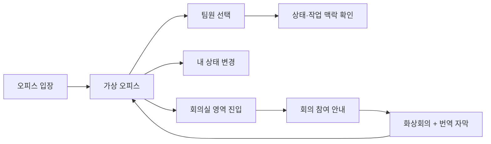

# Virtual Office Design Handoff

> 대상: 디자인 팀
>
> 상태: MVP 화면·상태 정의
>
> 관련 문서: [Realtime Meeting 계획](../realtime-meeting/README.md)

## 이 문서의 목적

이 문서는 화면을 어떤 스타일로 만들어야 하는지 정하는 문서가 아니다. 디자인 팀이 사용자가 실제로 경험할 장면, 각 장면에서 확인해야 하는 정보, 필요한 상태와 상호작용을 빠뜨리지 않도록 전달하는 기준이다.

Virtual Office의 핵심은 장식적인 메타버스가 아니라, 원격 팀원이 **지금 누구에게 어떤 방식으로 말을 걸 수 있는지** 빠르게 판단하게 돕는 것이다.

## 디자인 원칙

- 팀원의 상태는 감시나 평가가 아닌, 협업 타이밍을 판단하는 정보로 보인다.
- 사용자가 직접 선택·수정한 상태와 AI가 제안한 상태를 혼동하지 않게 구분한다.
- 픽셀 오피스와 정보 UI가 한 화면에서 충돌하지 않게 한다.
- 회의 입장과 카메라·마이크 권한은 사용자의 명시적 행동 뒤에 시작한다.
- 네트워크 지연, 빈 오피스, 회의 연결 실패도 정상 흐름으로 디자인한다.

## 디자인 범위

### P0에서 필요한 장면

| 장면 | 사용자의 목적 | 반드시 보여야 할 정보 | 주요 행동 |
| --- | --- | --- | --- |
| 오피스 입장 준비 | 입장 전 자신의 언어·기본 상태를 확인 | 팀 이름, 언어, 현재 상태, 입장 진행 상태 | 입장, 언어 변경 |
| 가상 오피스 기본 화면 | 팀원과 공간을 한눈에 파악 | 내 아바타, 팀원 아바타, 이름, 협업 상태, 회의실 위치 | 이동, 팀원 선택, 상태 변경 |
| 내 상태 변경 | 지금 가능한 협업 방식을 공유 | 상태, 한 줄 작업 맥락, 응답 가능 시간, 저장 상태 | 선택, 수정, 저장 |
| 팀원 정보 카드 | 질문·회의 요청의 타이밍 판단 | 이름, 상태, 한 줄 작업 맥락, 응답 가능 시간, 회의·메시지 가능 여부 | 카드 닫기, 회의 요청 |
| 회의실 진입 안내 | 회의 참여 여부를 결정 | 회의실 이름, 현재 참여자 또는 참여 가능 정보, 참여 버튼 | 참여, 닫기 |
| 회의 오버레이 | 영상회의와 번역 자막 확인 | 참가자 영상, 마이크·카메라 상태, 원문·번역 자막, 나가기 | 음소거, 카메라, 언어 선택, 나가기 |
| 연결·오류 상태 | 현재 상황을 이해하고 복구 | 연결 중, 재연결 중, 권한 거부, 연결 실패, 재시도 수단 | 재시도, 설정 확인, 닫기 |

### P1 또는 후순위 장면

- AI가 제안하는 상태 초안과 사용자의 수정·거절 화면
- 회의 종료 후 AI 브리핑 편집·확정 화면
- 팀 브리핑 피드
- 라운지의 아이스브레이킹 질문 카드

P1 화면은 P0 오피스 UI와 공통 컴포넌트를 재사용할 수 있게 설계하되, P0 시안 완성보다 먼저 확정하지 않는다.

## 핵심 사용자 흐름



### 기본 오피스 화면에서 사용자가 알아야 하는 것

1. 내가 어디에 있는가: 내 아바타와 회의실·라운지·책상 같은 공간의 의미
2. 누가 함께 있는가: 이름과 식별 가능한 아바타
3. 지금 말을 걸어도 되는가: 협업 가능 상태, 회의 중 여부, 응답 가능 시간
4. 다음 행동은 무엇인가: 팀원을 선택하거나 회의실로 이동하는 방법

## 컴포넌트 및 상태 요구사항

### 1. 아바타 위 정보

각 아바타에는 아래 정보가 겹치지 않도록 표시된다.

| 요소 | 필수 여부 | 상태 |
| --- | --- | --- |
| 이름 | 필수 | 긴 이름도 잘리지 않거나 읽을 수 있는 처리 필요 |
| 협업 상태 | 필수 | `협업 가능`, `집중 작업`, `회의 중`, `자리 비움` |
| 회의 중 표시 | 필수 | 카메라·마이크 상태가 바뀔 수 있음 |
| 작업 맥락 | 선택 시 표시 | 한 줄 텍스트, 팀원이 공개한 경우에만 표시 |

상태는 색상 하나에만 의존하지 않는다. 텍스트 또는 아이콘을 함께 제공한다.

### 2. 팀원 정보 카드

팀원 아바타를 선택할 때 열리는 정보 카드다.

- 기본: 이름, 상태, 한 줄 작업 맥락, 응답 가능 시간
- 상태별 행동: `회의 중` 또는 `집중 작업`일 때도 회의 요청을 강요하지 않고, 현재 상태를 먼저 이해하게 한다.
- 빈 정보: 작업 맥락이나 응답 가능 시간이 없을 수 있는 상태를 포함한다.
- 오류: 사용자가 오피스를 떠났거나 상태가 갱신되면 자연스럽게 닫히거나 최신 상태로 갱신된다.

### 3. 내 상태 변경 패널

사용자는 스스로 상태를 선택하고, 선택적으로 작업 맥락과 응답 가능 시간을 입력한다.

| 입력 | P0 | 비고 |
| --- | --- | --- |
| 협업 상태 | 필수 | 4개 상태 중 하나 선택 |
| 한 줄 작업 맥락 | 선택 | 길이 제한과 빈 상태 필요 |
| 응답 가능 시간 | 선택 | 예: `30분 후`, `오후 3시 이후` |
| AI 제안 근거 | P1 | 사용자가 확인·수정·거절 가능해야 함 |

저장 전, 저장 중, 저장 성공, 저장 실패 상태가 필요하다. 사용자가 저장하지 않은 입력이 사라지는 상황도 고려한다.

### 4. 회의실 진입 안내

회의실 영역에 들어갔다는 사실만으로 카메라·마이크 권한을 요청하지 않는다.

- 회의실 이름
- 참여 또는 닫기 행동
- 연결 중 상태
- 권한 거부와 재시도 상태
- 이미 회의 중인 팀원이 있다면 참여자 정보 표시 영역

### 5. 회의 오버레이

회의 UI의 상세 화면과 자막 상태는 Realtime Meeting 디자인 범위이지만, Virtual Office와의 전환을 함께 고려한다.

- 오피스가 배경에 남는 축소형 회의 상태 또는 회의에 집중하는 전체화면 상태
- 전체화면에서는 오피스 이동 조작이 비활성화됨
- 회의 종료 시 오피스 화면과 이전 사용자 맥락으로 복귀
- 원문, 번역문, 발화자, 시각, 처리 중, 번역 실패 상태

## 화면별 Figma 산출물

| 우선순위 | Figma Frame | 확인할 상태 |
| --- | --- | --- |
| P0 | `Office / Default` | 팀원 0명, 여러 명, 내 상태별 표시 |
| P0 | `Office / Member Selected` | 협업 가능, 집중 작업, 회의 중, 자리 비움 |
| P0 | `Office / My Status` | 기본, 입력 중, 저장 중, 저장 실패 |
| P0 | `Office / Meeting Entry` | 참여 전, 연결 중, 권한 거부, 연결 실패 |
| P0 | `Meeting / Overlay` | 축소형, 전체화면, 자막 있음, 자막 처리 중 |
| P0 | `Office / Connection State` | 초기 로딩, 재연결, 빈 오피스 |
| P1 | `Office / AI Status Suggestion` | 제안, 수정, 거절, 근거 보기 |

## 오피스 에셋 준비 기준

아래 기준으로 에셋을 준비한다. 맵 데이터를 연결하는 세부 작업은 개발팀이 담당한다.

| 항목 | 합의할 내용 |
| --- | --- |
| 타일 기준 크기 | 맵과 아바타가 공유하는 픽셀 단위 및 배율 |
| 아바타 | 4방향 idle/walk 프레임, 투명 배경, 프레임 규격 |
| 공간 구분 | 통과 가능한 공간과 벽·가구처럼 막혀야 하는 공간을 구분해 전달 |
| 공간 의미 | 회의실, 책상, 라운지가 시각적으로 구분되며 상호작용 가능 영역을 암시 |

## 권장 에셋 파일 규격

아래는 첫 MVP의 권장 초안이다. 타일 크기와 아바타 프레임 크기는 시작 전에 확정하고, 확정 뒤에는 원본 규격을 바꾸지 않는다.

| 에셋 | 원본 형식 | 권장 규격 | 비고 |
| --- | --- | --- | --- |
| 오피스 맵 | `.tmj` | 타일 `16 x 16px` | 맵 데이터를 담는 파일, 개발팀이 연결 |
| 타일셋 | `.png` | 각 타일 `16 x 16px`, 전체는 16의 배수 | 투명 배경, 타일 간 여백 없음 |
| 아바타 Sprite Sheet | `.png` | 한 프레임 `16 x 32px`, 전체 가로·세로는 프레임의 배수 | 투명 배경, 프레임 간 여백 없음 |
| 아바타 프로필 썸네일 | `.png` | `32 x 64px` 또는 원본 프레임과 동일한 `16 x 32px` | UI에서 확대해도 원본 비율 유지 |
| 오피스 미리보기 이미지 | `.webp` | 긴 변 최대 `1280px` | 로딩 화면·공유 카드용 |
| UI 아이콘 | `.svg` | `16`, `20`, `24px` 기준 | 상태·버튼에 사용 |
| UI 이미지·일러스트 | `.webp` 또는 `.png` | 표시 크기의 2배 이하 | 텍스트가 포함된 이미지는 피하고 UI 텍스트로 처리 |

### 왜 16px 타일을 권장하는가

- 데스크톱 화면에서 선명한 픽셀 표현을 유지할 수 있다.
- 가구, 벽, 회의실을 조합할 때 에셋 제작 기준이 일관된다.
- 아바타와 오피스 가구의 크기 관계를 맞추기 쉽다.

32px 타일로 시작하는 것도 가능하지만, 맵·가구·아바타 모든 에셋이 같은 배수로 다시 설계되어야 한다. 시작 후 16px와 32px를 섞지 않는다.

## 아바타 Sprite Sheet 규칙

### 필수 애니메이션

| 동작 | 방향 | 최소 프레임 | 설명 |
| --- | --- | --- | --- |
| Idle | 상·하·좌·우 | 방향별 1프레임 | 정지 상태 |
| Walk | 상·하·좌·우 | 방향별 4프레임 권장 | 이동 상태 |

- 프레임은 좌에서 우, 위에서 아래 순서의 균일한 격자에 둔다.
- 한 Sprite Sheet 안의 모든 프레임은 반드시 `16 x 32px`로 동일하다.
- 발 위치를 프레임 하단 기준으로 맞춘다. 그래야 책상·의자·벽 뒤의 깊이 표현이 자연스럽다.
- 캐릭터 외곽에 불필요한 반투명 여백을 넣지 않는다.
- 상태 아이콘, 이름표, 카메라·마이크 표시는 Sprite Sheet에 포함하지 않는다. 화면에서 별도로 표시한다.

권장 파일명 예시:

```text
avatars/
├── avatar-01.png
├── avatar-02.png
└── avatar-03.png
```

## 파일 용량 예산

초기 데모에서 첫 로딩이 길어지지 않도록 아래를 목표로 한다. 이는 엄격한 제한이 아니라, 초과 시 최적화 여부를 함께 확인하는 기준이다.

| 항목 | 권장 최대 용량 | 확인 기준 |
| --- | --- | --- |
| 아바타 Sprite Sheet 1개 | `150KB` | 투명 PNG 압축 후 확인 |
| 타일셋 1개 | `1MB` | 중복·사용하지 않는 타일 제거 |
| 오피스 미리보기 | `300KB` | WebP 품질 조정 |
| 최초 화면 에셋 전체 | `5MB` | 개발팀이 로딩 속도를 확인 |
| 한 화면의 UI 이미지 | `500KB` | 큰 이미지는 지연 로드 또는 축소 |

픽셀 아트의 맵·타일·아바타는 투명도와 가장자리 품질이 안정적인 PNG를 기본으로 사용한다. 사진형 미리보기·배경처럼 픽셀 정밀도가 덜 중요한 이미지에만 WebP를 사용한다.

## 파일명과 전달 방식

- 파일명은 영문 소문자와 하이픈만 사용한다. 예: `meeting-room-sign.png`
- 공백, 한글 파일명, `final-final`, 날짜가 섞인 임시 파일명은 사용하지 않는다.
- 에셋 교체 시 기존 파일을 조용히 덮어쓰지 않고, Figma 링크 또는 Issue에 변경 이유와 영향을 남긴다.
- Figma에서 내보낼 때는 같은 폴더의 파일이 어떤 Frame 또는 Component에서 왔는지 알 수 있게 전달한다.
- 원본 작업 파일과 런타임에 포함할 최종 에셋을 구분한다. Figma 내보내기 원본·PSD는 Git에 넣지 않는다.

## 반응형 기준

MVP의 완성도 기준은 데스크톱 브라우저다. 2D 오피스에서 이동과 여러 팀원 상태를 확인하는 흐름을 우선 검증한다.

모바일은 기능을 숨기지 않되, 아래의 최소 사용성을 확보한다.

- 오피스 캔버스가 잘리거나 조작 UI와 겹치지 않는다.
- 팀원 정보 카드와 상태 변경 패널은 작은 화면에서 읽을 수 있다.
- 회의 참여와 자막 확인은 가능하다.

## 개발팀에 확인이 필요한 항목

- 시작 시 제공할 아바타 수와 커스터마이징 범위
- 최초 데모 오피스의 맵 크기와 타일 기준 크기
- 팀원 정보 카드에서 메시지 기능을 P0에 포함할지 여부
- 회의실별 고정 룸 이름을 사용할지, 팀·시간 기준으로 Server가 생성할지 여부
- 한국어·영어 UI 전환을 P0에 포함할지 여부

이 항목은 디자인 작업을 멈추게 하는 질문이 아니다. 기본 시안에는 확장 가능한 영역을 두고, 개발·기획 결정이 나면 상태와 문구만 보완한다.
