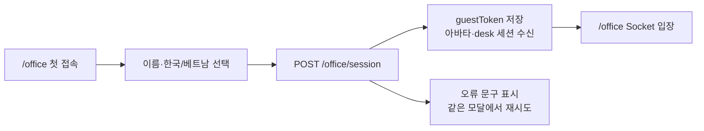

# Guest Office Onboarding

> 작성일: 2026-08-16
>
> 관련 Issue: #40

## 목표

로그인 없이 데모 사용자가 이름과 소속 국가를 선택하고, 바로 가상 오피스에 입장한다. URL query나 개발자 도구 입력을 요구하지 않는다.

## 사용자 흐름

## 브라우저 저장 기준

| 항목 | 저장 위치 | 목적 | 외부 전파 |
| --- | --- | --- | --- |
| 이름·국가·언어 | localStorage | 재방문 시 입력 생략 | 세션 API와 Socket 입장 시 전달 |
| guest token | localStorage | 같은 멤버·desk 복구 | Server 소유권 검증에만 전달 |
| 실제 작업 화면·입력 | 저장하지 않음 | 감시 기능 제외 | 전달하지 않음 |

## 오류 상태

- 이름이 비어 있으면 브라우저의 required 검증으로 제출하지 않는다.
- 세션 API 실패 시 오피스 Socket을 열지 않고 모달 안에 오류를 보인다.
- 저장된 프로필 자동 복구가 실패해도 사용자는 같은 모달에서 다시 입력할 수 있다.

## 후속 범위

- 아바타 후보를 사용자가 직접 선택하는 기능
- 프로필 수정과 guest token 초기화
- 초대 링크별 workspace 선택
