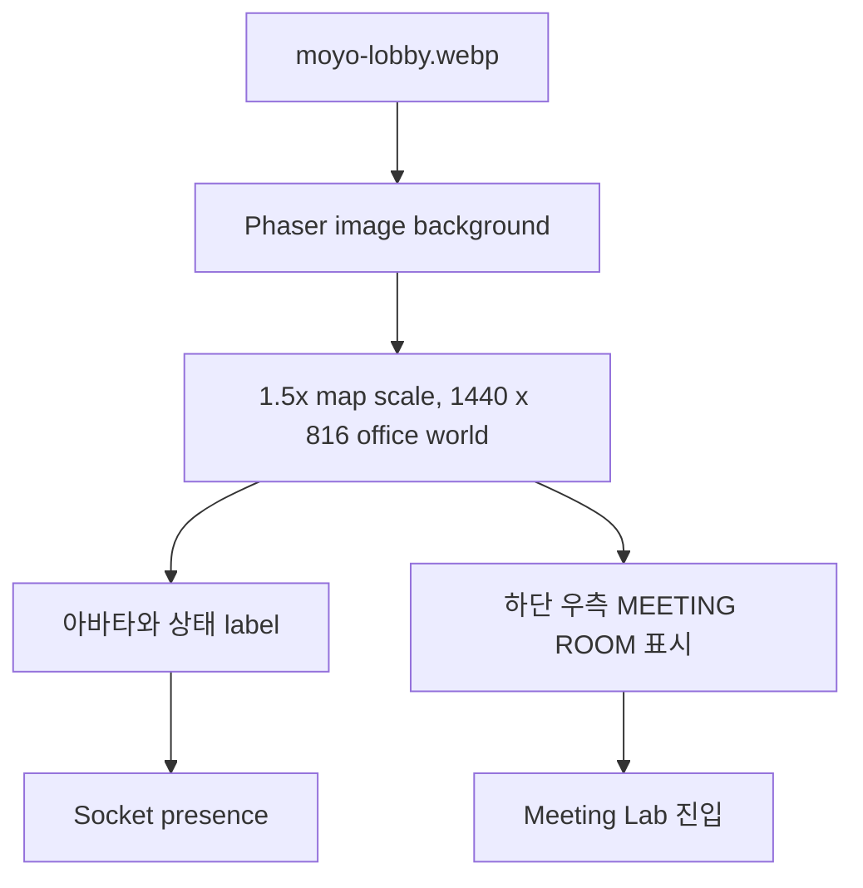

# Office Map Prototype

## 목적

Virtual Office의 아바타 이동, 상태 label, 회의 구역 진입을 빈 격자 대신 실제 오피스 맥락에서 확인한다. 디자인팀의 최종 타일맵이 준비되기 전까지는 맵 한 장을 배경으로 사용한다.

## 적용 에셋

- 경로: `apps/client/public/assets/maps/moyo-lobby.webp`
- 원본: [boostcampwm2025/web13-isj-dle](https://github.com/boostcampwm2025/web13-isj-dle) `apps/client/public/assets/maps/lobby.webp`
- 사용 목적: 내부 개발·해커톤 프로토타입의 오피스 배경 mock
- 적용 전 확인: 외부 공개·상용 사용 또는 최종 배포 전 원본 권리와 사용 가능 범위를 확인하고, 필요하면 팀 제작 에셋으로 교체한다.

## Scene 구성

- `960 x 544` 원본 맵을 Phaser world에서 `1.5x`로 확대해 `1440 x 816`으로 표시한다. 아바타 scale은 그대로 유지해 가구와의 상대 비율을 맞춘다.
- 하단 우측 라운지와 회의 구역 좌표도 같은 `1.5x` 비율로 확대한다.
- 오피스 경로는 브라우저 전체 화면 Canvas로 표시하고, 화면 크기에 맞춰 map의 최대 78%만 보이도록 camera zoom을 계산한다.
- 맵 image는 world 중앙에 배치한다. camera는 local avatar를 따라가며 zoom 변경 직후에도 local avatar 좌표를 중심으로 다시 정렬하고, world bound에서만 멈춘다. 따라서 맵 전체를 한 화면에 고정하지 않고 이동에 따라 시점이 바뀐다.
- local·remote avatar의 depth는 Y 좌표에 따라 갱신해 가구·아바타의 앞뒤 관계를 읽기 쉽게 한다.

### 수동 zoom

- 마우스 휠 또는 트랙패드의 세로 스크롤로 `0.75`~`3.2` 범위에서 local avatar를 기준으로 zoom in/out 한다.
- 기본 zoom은 화면 크기에 따라 정하지만, 사용자가 조절한 zoom 값은 창 크기를 변경해도 유지한다.
- 이 설정은 local browser 화면에만 적용하며, Socket payload나 다른 팀원의 camera에는 전송하지 않는다.

## 현재 제한사항

- 책상·소파·벽의 충돌 영역은 아직 설정하지 않았다. 현재는 world boundary만 충돌한다.
- 최종 맵에는 Tiled map의 collision layer 또는 별도 장애물 contract를 연결한다.
- 맵은 시각 프로토타입이며, 사용자 상태·TODO·캘린더 UI와는 독립적으로 교체 가능하다.

## 수동 검증

1. `/office`에서 브라우저 전체를 Canvas가 채우고 lobby 배경이 왜곡 없이 표시되는지 확인한다.
2. 아바타가 맵 경계를 넘지 않고, 이동할 때 camera가 따라가며 하단 우측 회의 구역 진입 시 Meeting Lab 이동 UI가 나타나는지 확인한다.
3. 두 브라우저에서 remote avatar와 label이 가구 배경 위에 정상 표시되고, 캐릭터 높이가 책상·의자와 과도하게 차이나지 않는지 확인한다.
4. 마우스 휠과 트랙패드로 확대·축소하고, local avatar가 화면 중심에 유지되며 follow와 world boundary가 계속 동작하는지 확인한다.

> 작성일: 2026-08-17
>
> 관련 Issue: #78
