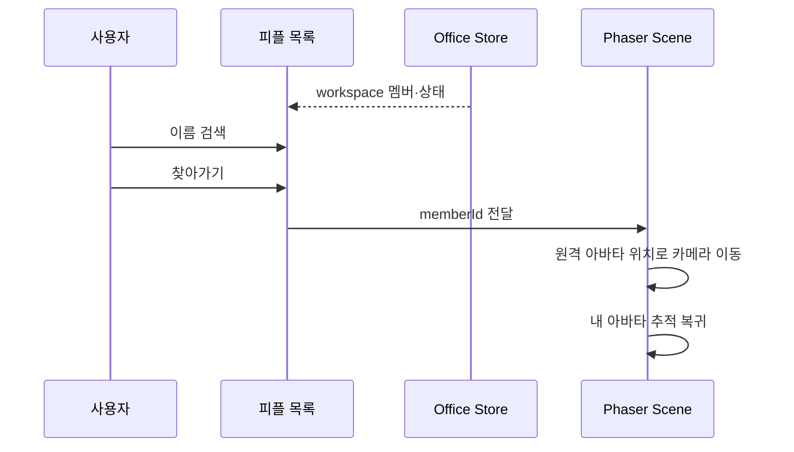

# People Directory

> 작성일: 2026-08-16
>
> 관련 Issue: #41

## 해결하는 문제

큰 가상 오피스에서 팀원이 어디에 있고, 현재 협업 가능한 상태인지 즉시 파악하기 어렵다. 피플 목록은 위치 탐색 시간을 줄이되 업무 감시 도구가 되지 않도록 최소 상태만 보여준다.

## 화면 책임

| 요소 | 표시 정보 | 행동 |
| --- | --- | --- |
| 피플 목록 | 이름, 인원 수, 연결·출퇴근·협업 상태 | 이름 검색 |
| 구성원 행 | active, ghost, sleeping, vacation, remote 표현 | 해당 위치로 카메라 이동 |
| Phaser 카메라 | 선택한 원격 아바타 위치 | 짧게 이동한 뒤 내 아바타 추적 복귀 |

## 상태 표현

| display mode | 목록 | 아바타 |
| --- | --- | --- |
| `active` | 협업 가능 | 기본 채도 |
| `ghost` | 연결 해제 | 낮은 채도 |
| `sleeping` | 퇴근 | 낮은 채도 |
| `vacation` | 휴가 중 | 주황 상태점 |
| `remote` | 재택 근무 | 파란 상태점 |

## 흐름

## 제외 범위

- 메시지 전송과 TODO 상세 조회는 별도 기능에서 구현한다.
- 피플 목록은 연결 상태를 실제 업무 성과나 활동량으로 해석하지 않는다.
- 멤버의 화면·카메라·키보드 정보는 표시하거나 저장하지 않는다.
