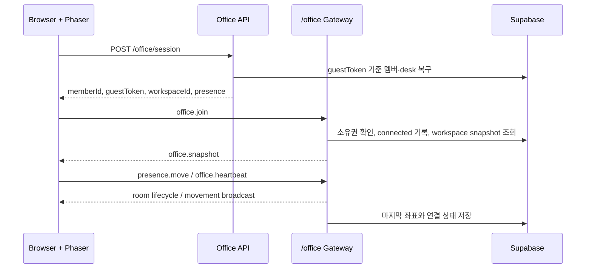

# Realtime Presence Pipeline

> 작성일: 2026-08-16
>
> 관련 Issue: #29
>
> 의존 작업: PR #26 게스트 세션과 상태 영속화

## 해결하는 문제

원격 팀원은 같은 공간에 있지 않아 현재 접속했는지, 퇴근했는지, 마지막으로 어디까지 업무를 진행했는지 확인하기 어렵다. 화면 감시 대신 사용자가 선택한 출퇴근·협업 상태와 오피스 내 위치만 공유한다.

## 책임 경계

| 영역 | 책임 | 저장 주기 |
| --- | --- | --- |
| Socket.IO | 입장, 이동 중계, heartbeat, disconnect 감지 | 즉시 |
| Supabase | 멤버, 고정 desk, 마지막 위치, 출퇴근·연결 상태 | 입장·상태 변경·1초 이동 flush·disconnect |
| Phaser | `officePresence.displayMode`에 따른 active/ghost 표현 | Socket 수신 즉시 |

## 흐름

## 개인정보·신뢰 경계

- 작업 화면, 키보드 입력, 카메라·마이크 데이터는 수집하지 않는다.
- `guestToken`은 Server 소유권 확인에만 사용하며 Socket room 또는 다른 사용자에게 전달하지 않는다.
- `connected`는 서비스 연결 상태일 뿐 실제 근무 성과를 뜻하지 않는다.
- 사용자가 선택한 출퇴근·상태 메시지만 신뢰 신호로 보여준다.

## 검증 시나리오

1. 서로 다른 브라우저에서 게스트 세션을 만들고 같은 workspace에 입장한다.
2. 한 사용자의 이동이 다른 화면의 원격 아바타에 반영되는지 확인한다.
3. 탭을 닫거나 Socket이 끊기면 해당 아바타가 ghost 상태로 바뀌는지 확인한다.
4. 다시 입장하면 같은 멤버·desk·마지막 위치가 복구되는지 확인한다.

## 후속 범위

- 휴가·재택 캘린더 이벤트로 상태를 자동 제안하는 기능
- TODO 공개 범위와 아바타 클릭 시 업무 맥락 보기
- 실시간 번역 회의 상태를 `meeting` 상태로 동기화하는 기능
