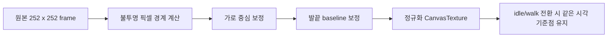
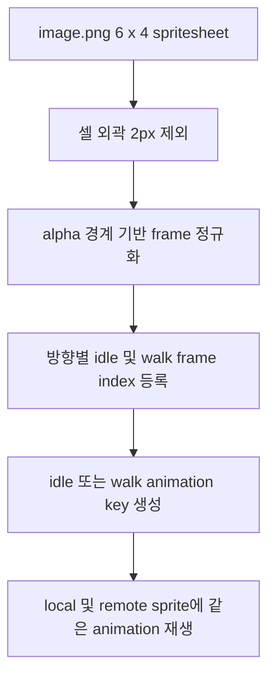
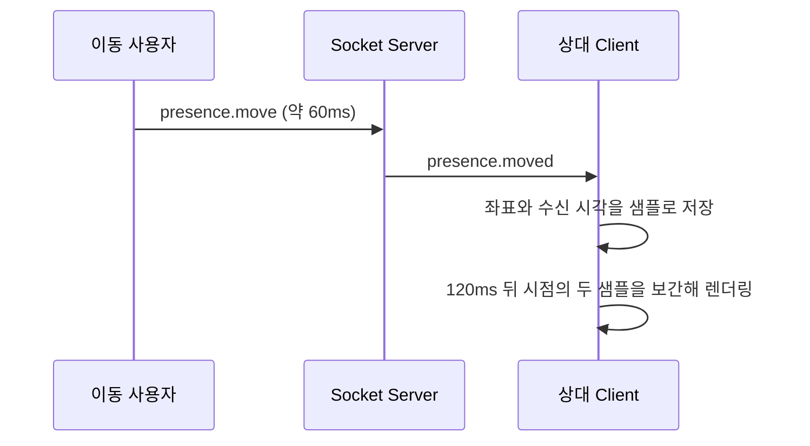
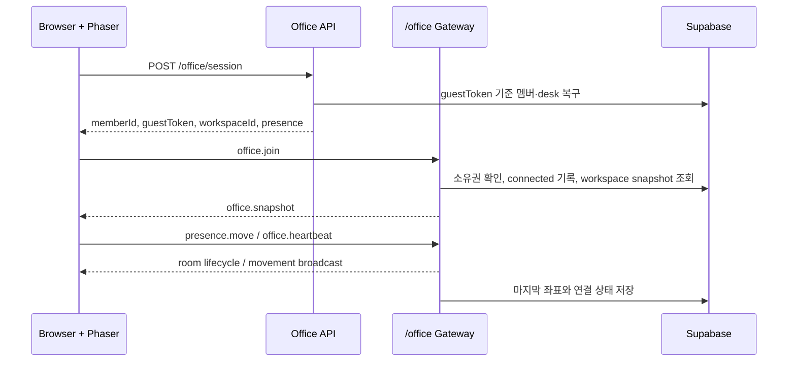

# Realtime Presence Pipeline

## 아바타 스프라이트시트

`apps/client/public/assets/image.png`는 `256 x 256px` 프레임으로 구성된 6열 x 4행 PNG 시트다. Phaser는 각 셀 외곽 `2px`을 제외한 `252 x 252px` 내부를 읽는다. export 과정에서 생길 수 있는 셀 경계의 비투명 픽셀이 화면에 보이지 않도록 하기 위함이다.

- 1행: `down`, `up`, `right` idle frame (`0`, `1`, `2`)
- 2행: `down walk` frame `6`~`11`
- 3행: `up walk` frame `12`~`17`
- 4행: `right walk` frame `18`~`23`
- `left`는 `right` frame을 `flipX`로 반전해 재사용한다.
- 현재 에셋은 측면 idle frame이 왼쪽을, 측면 walk frame이 오른쪽을 본다. 따라서 같은 `left/right` 방향이라도 idle과 walk에는 반대 `flipX` 규칙을 적용한다.
- Local과 remote avatar는 같은 정규화 texture, `idle/walk × up/down/left/right` animation key, `0.16` scale을 공유한다.
- 로컬 physics body는 발 주변으로만 잡아 가구 충돌 기준을 유지하고, 이름·상태 label과 ghost/sleeping 투명도는 sprite container에 그대로 적용한다.

### 발끝 기준 프레임 정렬

디자인 export에서 idle과 walk 프레임의 투명 여백이 서로 다를 수 있다. 같은 sprite 원점을 적용하면 물리 좌표는 고정돼도 걷기 시작·정지 순간 그림이 위아래 또는 좌우로 튀어 보인다.

Scene은 각 frame을 CanvasTexture로 만들 때 alpha 값이 있는 픽셀의 좌우·하단 경계를 계산한다. 이후 모든 frame의 가로 중심과 발끝을 공통 baseline(`y=236`)에 맞춰 다시 그린다. 이 과정은 표시용 texture에만 적용하므로 Arcade physics body, Socket 좌표, Supabase 위치 데이터는 변경하지 않는다.

- 이번 레드판다 시트에서 down idle의 발끝은 `y=236`, walk frame은 방향별 `y=209~228`이었다.
- baseline을 정규화하지 않으면 scale `0.16`에서도 전환 순간 최대 약 `4.3px`의 수직 점프가 보인다.
- 새 아바타를 받아도 런타임에서 alpha 경계를 다시 계산하므로, 같은 6열 x 4행 규격과 투명 배경만 지키면 별도 offset 상수를 추가할 필요가 없다.
- 검증 시 각 방향에서 `정지 → 이동 → 정지`를 반복해 발 위치, label, physics collision이 함께 흔들리지 않는지 확인한다.

### Moyo와 동일한 상태·방향 구조

Moyo의 구현처럼 방향별 frame index를 상수로 두고, Scene 시작 시 모든 animation을 미리 등록한다. 이동 payload의 `direction`과 `animation`은 sprite를 새로 만들지 않고 기존 animation key 선택에만 사용한다.

- 새 아바타를 추가할 때는 같은 6열 x 4행, `256 x 256px` frame 규격을 유지한다.
- 각 셀의 외곽은 완전 투명으로 export하는 것이 원칙이다. 현재 `2px` trim은 경계선이 포함된 에셋을 위한 방어 처리다.
- local·remote 아바타 모두에서 네 방향 이동과 정지 상태를 확인한다.

## 원격 이동 보간

원격 아바타의 이동 좌표는 Socket 수신 주기와 화면 렌더링 주기를 분리한다. Client는 약 60ms마다 변경된 위치를 전송하고, 수신 화면은 최근 좌표 샘플을 120ms만큼 뒤에서 시간 기반으로 보간한다.

- Socket payload와 1초 단위 Supabase 위치 영속화 정책은 바꾸지 않는다.
- 120ms는 수신 간격과 네트워크 흔들림을 흡수하기 위한 표시 지연이다.
- 새 좌표가 없어지면 마지막 좌표에서 멈춘다. 임의의 예측 이동은 하지 않는다.

> 작성일: 2026-08-16
>
> 관련 Issue: #29
>
> 의존 작업: PR #26 게스트 세션과 상태 영속화

## 해결하는 문제

원격 팀원은 같은 공간에 있지 않아 현재 접속했는지, 퇴근했는지, 마지막으로 어디까지 업무를 진행했는지 확인하기 어렵다. 화면 감시 대신 사용자가 선택한 출퇴근·협업 상태와 오피스 내 위치만 공유한다.

## 책임 경계

| 영역 | 책임 | 저장 주기 |
| --- | --- | --- |
| Socket.IO | 입장, 이동 중계, heartbeat, disconnect 감지 | 즉시 |
| Supabase | 멤버, 고정 desk, 마지막 위치, 출퇴근·연결 상태 | 입장·상태 변경·1초 이동 flush·disconnect |
| Phaser | `officePresence.displayMode`에 따른 active/ghost 표현 | Socket 수신 즉시 |

## 흐름

## 개인정보·신뢰 경계

- 작업 화면, 키보드 입력, 카메라·마이크 데이터는 수집하지 않는다.
- `guestToken`은 Server 소유권 확인에만 사용하며 Socket room 또는 다른 사용자에게 전달하지 않는다.
- `connected`는 서비스 연결 상태일 뿐 실제 근무 성과를 뜻하지 않는다.
- 사용자가 선택한 출퇴근·상태 메시지만 신뢰 신호로 보여준다.

## 검증 시나리오

1. 서로 다른 브라우저에서 게스트 세션을 만들고 같은 workspace에 입장한다.
2. 한 사용자의 이동이 다른 화면의 원격 아바타에 반영되는지 확인한다.
3. 탭을 닫거나 Socket이 끊기면 해당 아바타가 ghost 상태로 바뀌는지 확인한다.
4. 다시 입장하면 같은 멤버·desk·마지막 위치가 복구되는지 확인한다.

## 후속 범위

- 휴가·재택 캘린더 이벤트로 상태를 자동 제안하는 기능
- TODO 공개 범위와 아바타 클릭 시 업무 맥락 보기
- 실시간 번역 회의 상태를 `meeting` 상태로 동기화하는 기능
