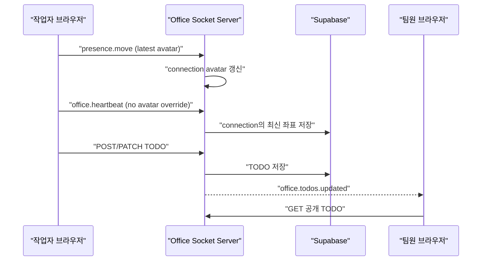

# Realtime State Sync

> 관련 Issue: [#96](https://github.com/LIKELION2026/LIKELION2026/issues/96)
>
> 대상: `apps/client`, `apps/server`, `packages/shared`

## 해결하는 문제

1. 로컬 아바타는 움직였지만 Client store의 `self.avatar`는 입장 당시 좌표였다. 25초 heartbeat가 이 오래된 좌표를 Server에 다시 보내면, lifecycle 이벤트가 Phaser 아바타를 desk의 최초 위치로 되돌릴 수 있었다.
2. TODO는 REST API로 저장한 뒤 요청한 브라우저만 다시 조회했다. 다른 팀원의 People 목록은 새로고침 전까지 이전 공개 TODO를 유지했다.

## 변경 흐름

## 책임 분리

| 경계 | 책임 | 하지 않는 일 |
| --- | --- | --- |
| Client movement store | 전송 직전에 local `self.avatar` 갱신 | 자기 자신에게 받은 중계 이벤트를 기다리지 않음 |
| Server presence | connection의 최신 avatar를 heartbeat와 DB 저장에 사용 | heartbeat로 오래된 Client 좌표를 덮어쓰지 않음 |
| TODO API | 본인 guest token으로 생성·수정 권한 확인 | TODO 본문을 Socket payload에 넣지 않음 |
| TODO Socket event | workspace 단위 변경 사실만 전달 | 비공개 TODO 내용을 다른 Client에 전송하지 않음 |
| 수신 Client | 공개 TODO API 재조회 | 타인의 TODO를 로컬에서 직접 수정하지 않음 |

## 검증 기준

| ID | 절차 | 기대 결과 |
| --- | --- | --- |
| RS-01 | 한 브라우저에서 이동 후 25초 이상 대기 | 로컬 아바타가 입장 위치로 되돌아가지 않음 |
| RS-02 | 이동 후 다른 브라우저의 lifecycle 갱신 확인 | 마지막 이동 위치가 유지됨 |
| RS-03 | A가 공개 TODO를 생성, B는 새로고침하지 않음 | B People 목록에 새 TODO가 표시됨 |
| RS-04 | A가 TODO를 비공개로 변경 | B 목록에서 해당 TODO가 제거됨 |
| RS-05 | B가 다른 workspace에 입장 | A workspace의 TODO 이벤트로 목록이 갱신되지 않음 |

## 자동 검증

- `apps/client/test/office-store.test.ts`: local `self.avatar` 위치 갱신
- `apps/server/test/presence.gateway.test.ts`: workspace room으로 TODO event 발행
- `apps/server/test/office.controller.test.ts`: TODO 생성·수정 성공 후 event 발행
- shared, client, server typecheck

브라우저 두 창 검증은 실제 Server URL로 Client를 함께 실행한 뒤 RS-01부터 RS-05까지 기록한다.
