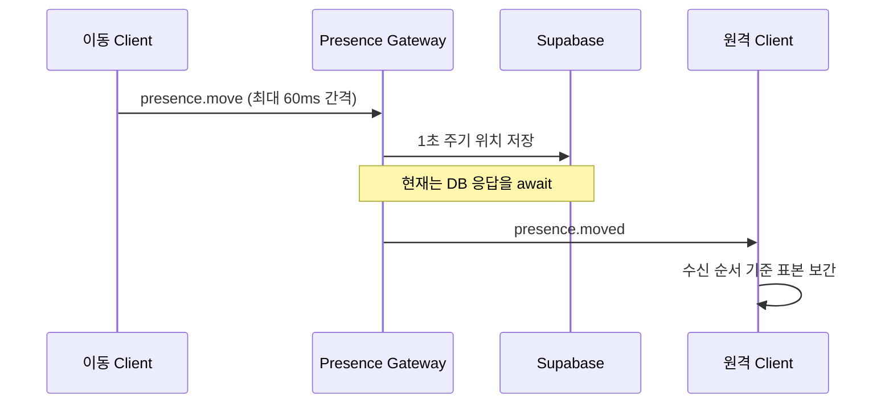
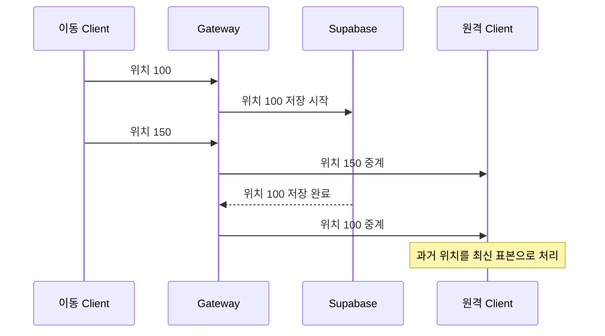

# 원격 아바타 이동 끊김 조사와 해결 계획

> 상태: 구현 완료, 브라우저 회귀 검증 대기
>
> 관련 Issue: [#87](https://github.com/LIKELION2026/LIKELION2026/issues/87)
>
> 대상: `apps/client`, `apps/server`, `packages/shared`

## 1. 문제

일반 브라우저와 시크릿 브라우저에서 같은 workspace에 입장한 뒤 한 사용자가 이동하면, 상대 화면의 원격 아바타가 부드럽게 이어지지 않고 일정 간격으로 멈추거나 뒤로 돌아가는 것처럼 보인다.

로컬 아바타의 Phaser physics 이동은 즉시 반응한다. 문제 범위는 **상대 Client에 표시되는 원격 아바타의 이동 동기화**다.

## 2. 재현 절차

1. 일반 창에서 `/office`에 입장한다.
2. 시크릿 창에서 같은 workspace로 `/office`에 입장한다.
3. 한 창에서 방향키 또는 WASD를 3초 이상 계속 누른다.
4. 반대 창에서 해당 아바타가 연속적으로 이동하는지, 이전 위치로 되돌아가는지 확인한다.

## 3. 확인된 데이터 흐름

| 경계 | 현재 동작 | 근거 |
| --- | --- | --- |
| 전송 | 변경된 위치를 최소 60ms 간격으로 전송 | `use-office-socket.ts`의 `MOVEMENT_INTERVAL_MS` |
| Server 상태 | 수신 payload를 connection의 현재 avatar로 반영 | `PresenceService.move()` |
| 영속화 | 1초마다 Supabase 위치 저장을 기다림 | `POSITION_PERSIST_INTERVAL_MS`, `await updateRealtimeMemberPosition()` |
| 중계 | `move()`가 반환된 뒤 상대 Socket room에 이벤트 발행 | `PresenceGateway.handlePresenceMove()` |
| 표시 | 수신 시각을 표본 시간으로 사용해 120ms 지연 보간 | `OfficeScene.updateRemoteAvatars()` |

## 4. 근본 원인

### 4.1 DB 저장이 실시간 중계를 막고 오래된 좌표를 뒤늦게 보낸다

`PresenceService.move()`는 영속화 시점에 `updateRealtimeMemberPosition()`을 `await`한다. 그 사이 새 이동 이벤트가 계속 들어오므로, 이전 위치의 DB 요청이 최신 위치 처리보다 늦게 완료될 수 있다.

또한 `lastPersistedAt`은 DB 요청 완료 후에만 갱신된다. DB 요청이 진행되는 동안 여러 이동 이벤트가 각각 위치 저장을 시작할 수 있어, 같은 사용자의 이전 좌표 저장 요청이 중첩된다.

### 4.2 수신 Client가 패킷의 최신성을 판별하지 못한다

Gateway는 DB 요청이 끝난 뒤 `occurredAt`을 새로 만들고, Client는 이 값을 사용하지 않고 도착 시각을 표본 시간으로 기록한다. 따라서 늦게 도착한 과거 좌표가 가장 최신 표본으로 추가된다.

현재의 120ms 보간은 정상 순서의 패킷을 부드럽게 연결할 뿐이다. 순서가 역전된 좌표까지 부드럽게 재생하므로, 아바타가 뒤로 움직였다가 다시 앞으로 가는 현상이 생긴다.

## 5. 해결 원칙

1. **실시간 중계는 DB 응답을 기다리지 않는다.** Socket payload는 수신 즉시 같은 team room에 발행한다.
2. **DB 영속화는 최신 위치만 비동기로 저장한다.** 저장 결과는 connection의 실시간 avatar를 덮어쓰지 않는다.
3. **모든 이동 이벤트에 연결 단위 순번을 둔다.** 수신 Client는 이미 처리한 순번보다 작거나 같은 이벤트를 폐기한다.
4. **재연결 시 순번 기준을 초기화한다.** `office.member.joined` 또는 새 connection 식별자를 기준으로 원격 아바타의 표본과 마지막 순번을 다시 만든다.

## 6. 구현 계획

### 단계 1. 이동 계약에 순번 추가

- `packages/shared`의 `PresenceMovePayload`, `PresenceMovedPayload`에 `sequence`를 추가한다.
- 전송 Client는 Socket 연결 하나당 `0`부터 증가하는 순번을 붙인다.
- Gateway는 받은 순번을 바꾸지 않고 그대로 중계한다.
- `office.member.joined` 처리에서 해당 `memberId`의 마지막 수신 순번을 초기화한다.

**완료 기준:** payload 타입, Gateway validation, Client 송수신 타입이 같은 `sequence` 필드를 사용한다.

### 단계 2. 중계와 영속화 분리

- `PresenceGateway.handlePresenceMove()`는 최신 payload를 받은 직후 다른 room에 발행한다.
- `PresenceService`는 connection별로 `latestAvatar`, `persisting`, `lastPersistedAt`을 관리한다.
- 위치 저장은 1초 간격으로 하나만 실행하고, 저장 중 새 좌표가 오면 마지막 좌표만 다음 저장 대상으로 남긴다.
- DB 응답은 연결 상태의 출퇴근·heartbeat 정보에만 사용하고, 실시간으로 갱신된 avatar를 과거 값으로 되돌리지 않는다.

**완료 기준:** 느린 DB 저장 Promise가 해결된 뒤에도 connection의 avatar와 다음 Socket 이벤트는 가장 최신 위치를 유지한다.

### 단계 3. 수신 표본 보호

- 원격 아바타별 `lastSequence`을 관리한다.
- 받은 `sequence`이 `lastSequence` 이하이면 Store와 Phaser 표본 버퍼에 넣지 않는다.
- 정상 순번의 표본만 기존 120ms 보간에 전달한다.

**완료 기준:** 늦게 도착한 과거 이벤트는 화면 위치, animation, label을 변경하지 않는다.

### 단계 4. 검증과 관측

- Server 테스트에서 지연된 위치 저장 Promise와 연속 이동 payload를 재현한다.
- Client 테스트 또는 순수 helper 테스트에서 `5 → 7 → 6` 순서 이벤트가 최종 위치 `7`을 유지하는지 확인한다.
- 개발 환경에서는 event sequence, 수신 지연, 폐기한 과거 패킷 수를 개발 전용 로그로 확인한다.
- 두 브라우저에서 10초 직선 이동, 방향 전환, 탭 전환 후 복귀를 각각 수행한다.

**완료 기준:** 원격 아바타가 뒤로 되돌아가지 않고, DB 저장 지연이 있어도 연속 이동으로 보인다.

## 7. 검증 시나리오

| ID | 시나리오 | 기대 결과 |
| --- | --- | --- |
| RM-01 | 두 브라우저에서 한 사용자가 10초 직선 이동 | 원격 아바타가 역방향 점프 없이 연속 이동 |
| RM-02 | 이동 중 방향을 빠르게 5회 전환 | 마지막 방향과 위치가 원격 화면에 유지 |
| RM-03 | DB 저장 Promise를 의도적으로 지연 | 실시간 중계가 저장 완료를 기다리지 않음 |
| RM-04 | 과거 sequence 이벤트를 최신 이벤트 뒤에 전달 | Client가 과거 이벤트를 폐기 |
| RM-05 | 이동 후 탭을 닫고 다시 접속 | 새 입장 이벤트 뒤 원격 표본과 순번 기준이 정상 초기화 |

## 8. 범위와 비범위

### 이번 범위

- 원격 아바타 위치·방향·idle/walk 상태의 순서 보장
- Supabase 위치 영속화와 Socket 중계 책임 분리
- 자동 테스트와 두 브라우저 수동 테스트

### 이번 범위에서 제외

- 이동 예측과 서버 authoritative physics
- 가구·벽 collision layer
- 네트워크 품질에 따른 동적 interpolation delay 조정
- 위치 이벤트 장기 이력 저장

## 9. 담당 경계

| 영역 | 담당 역할 | 검토 포인트 |
| --- | --- | --- |
| `packages/shared` | FE + BE | payload 순번과 재연결 규칙 합의 |
| `apps/server` | BE | 중계 우선, 영속화 직렬화, 과거 DB 응답 차단 |
| `apps/client` | FE | sequence 폐기, 표본 보간 유지, 개발 관측 |
| QA | 전원 | 두 브라우저 및 지연 저장 시나리오 실행 |

## 10. 구현 및 검증 기록

- 2026-08-17: 일반 창과 시크릿 창에서 원격 이동이 버벅이는 영상을 확보했다.
- 코드 추적 결과, 60ms 이동 전송·1초 DB 저장·수신 순서 기준 보간의 경계에서 순서 역전 가능성을 확인했다.
- `presence.move`와 `presence.moved`에 연결별 `sequence`를 추가했다. 수신 Client는 member별 마지막 sequence 이하의 패킷을 Store에 전달하지 않는다.
- Server는 위치 저장을 `setTimeout` 기반의 최신 위치 영속화로 분리했다. `move()`와 Gateway 중계는 Supabase 위치 저장 Promise를 기다리지 않는다.
- Server 회귀 테스트에서 위치 저장 Promise가 pending이어도 `move()`가 즉시 반환하는 것을 확인했다.
- `apps/server/.env`를 실제로 읽는 환경 변수 검증, Nest 서버 기동, `GET /health` 응답을 확인했다. 키 값은 출력하지 않았다.

### 실제 Socket 통합 검증 상태

두 개의 새 게스트 세션을 만든 뒤 연속 이동 이벤트의 sequence를 검사하는 통합 테스트를 시도했다. 서버와 Supabase 연결은 성공했으나, 새 세션 생성이 `409 No available desk remains in this office`로 거절됐다. 이는 환경 변수 또는 Socket 오류가 아니라 현재 Supabase workspace의 테스트용 desk가 모두 점유된 데이터 상태다.

기존 팀원의 guest token을 사용하거나 운영 데이터를 변경하지 않는다. desk 여유를 확보한 뒤 아래 RM-01, RM-02를 일반 창과 시크릿 창에서 실행해 최종 결과를 Issue #87과 PR에 기록한다.
