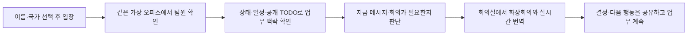

# Virtual Office User Scenarios

> 대상: 한국과 베트남에 나뉘어 일하는 소규모 협업 팀
> 서비스 목적: 업무 화면을 감시하지 않고도, 팀원의 협업 가능 상태·일정·업무 맥락을 같은 가상 오피스에서 이해하고 필요한 순간에 대화와 회의로 연결한다.

## 서비스가 해결하려는 흐름

## 등장 인물

| 인물 | 소속·역할 | 현재 상황 |
| --- | --- | --- |
| 민지 | 한국 팀 프론트엔드 개발자 | 회의 번역 자막 UI를 구현 중 |
| An | 베트남 팀 백엔드 개발자 | 자막 API 응답 형식과 회의 연동을 담당 |
| 팀 리더 | 한국 팀 프로젝트 매니저 | 팀의 중요한 일정과 협업 공백을 조율 |

## 시나리오 1. 첫 입장과 같은 오피스 인지

**문제:** 로그인·초대 절차가 길면 해커톤 데모와 가벼운 협업 시작을 방해한다.

1. 민지는 서비스에 접속해 이름과 국가를 선택한다.
2. 시스템은 임의 아바타와 게스트 세션을 생성하고, 민지를 한국 구역의 지정 데스크에 배치한다.
3. 민지는 오피스에 접속 중인 An과 팀 리더의 아바타, 출근·퇴근·재택·자리 비움 상태를 본다.
4. 같은 공간에 있지 않아도 누가 오피스에 연결되어 있는지 직관적으로 인지한다.

**사용자 가치:** 복잡한 계정 설정 없이 가상 오피스에 들어와 협업 시작점을 공유한다.

**현재 구현:** 게스트 입장, 세션 복구, Socket 기반 접속·출퇴근·상태·위치 동기화.

## 시나리오 2. 오늘의 업무 맥락을 자발적으로 공유

**문제:** 원격 팀원은 상대가 업무 중인지, 어떤 작업을 진행하는지 알기 어려워 불필요한 확인 메시지나 오해가 생긴다.

1. 민지는 자신의 아바타 또는 데스크를 선택한다.
2. **내 업무 패널**에서 `회의 번역 자막 UI 연결` TODO를 작성하고 팀 공개로 설정한다.
3. 민지는 상태를 `진행 중`으로 표시하고 작업을 시작한다.
4. 작업이 막히면 TODO를 `도움 필요`로 바꾸고, 필요한 도움을 짧은 제목으로 보완한다.
5. 작업이 끝나면 `완료`로 바꾼다.

**사용자 가치:** 화면 공유나 활동량 감시 없이, 본인이 선택한 최소한의 업무 맥락만 팀에 전달한다.

**현재 구현:** TODO 서버 API와 데이터 controller. 패널 디자인·아바타 클릭 연결·실시간 전파는 후속 구현.

## 시나리오 3. People 목록으로 팀원을 찾아 판단

**문제:** 큰 오피스에서 특정 팀원을 찾기 어렵고, 단순 온라인 표시만으로는 지금 연락해도 되는지 알 수 없다.

1. An은 좌측 `People` 목록을 연다.
2. 이름으로 민지를 검색하고 현재 상태와 위치를 확인한다.
3. 민지의 아바타로 찾아가거나 프로필을 연다.
4. 프로필에서 민지가 공개한 TODO와 `진행 중` 상태를 확인한다.
5. 단순 확인으로 해결되면 메시지를 보내지 않고, API 응답 규격 논의가 필요할 때만 회의실로 부른다.

**사용자 가치:** 상대의 화면을 보지 않아도 공개된 협업 정보로 연락·회의 필요성을 판단한다.

**현재 구현:** People 목록, 이름 검색, 상태 표현, 맵 위치로 이동. 타인 프로필과 공개 TODO 표시 UI는 후속 구현.

## 시나리오 4. 공유 일정으로 협업 공백을 미리 조정

**문제:** 휴가·재택·회의 같은 중요한 일정이 공유되지 않으면, 의존 작업을 계획한 뒤에야 담당자의 부재를 알게 된다.

1. 팀 리더는 공유 캘린더에 An의 휴가와 팀 정기 회의 시간을 등록한다.
2. 민지는 다음 주 자막 API 연동 계획을 세울 때 An의 휴가 기간을 확인한다.
3. 민지는 구현 순서를 조정하거나 휴가 전까지 필요한 응답 형식을 합의한다.
4. 오피스에서는 일정과 연결된 재택·휴가 상태가 아바타 또는 데스크에 나타난다.

**사용자 가치:** 상대가 부재한 뒤에 지연을 발견하는 대신, 의존 관계와 일정을 미리 조정한다.

**현재 구현:** 후속 범위. Supabase의 일정·Presence 데이터 모델을 기반으로 캘린더와 아바타 상태를 연결한다.

## 시나리오 5. 회의실에서 언어 장벽을 낮춘다

**문제:** 한국어와 베트남어를 함께 쓰는 회의에서 발화가 즉시 이해되지 않으면, 결정 확인 시간이 늘어나고 오해가 생긴다.

1. 민지는 An을 회의실로 부르거나 둘 다 회의실 구역으로 이동한다.
2. 두 사람은 화상회의에 입장하고 각자 한국어 또는 베트남어로 말한다.
3. 시스템은 발화 원문과 상대 언어 번역 자막을 함께 제공한다.
4. API 응답 형식이라는 결정이 생기면, 회의 중 공유한 내용과 다음 행동을 확인한다.
5. 회의가 끝나면 각자 TODO를 업데이트하고 다시 오피스 업무로 돌아간다.

**사용자 가치:** 언어가 다른 팀원이 회의 내용을 즉시 이해하고, 결정 후 다음 행동으로 자연스럽게 이어간다.

**현재 구현:** LiveKit Meeting Lab, 장치 확인, 화상 미디어, Mock 자막 수신과 표시. 실제 STT·번역 Agent와 회의 요약 연결은 후속 범위다.

## 시나리오 6. 팀 리더가 감시 없이 협업 위험을 발견

**문제:** 원격 팀의 리더는 일의 진행 상황을 전혀 모르거나, 반대로 개인 화면을 요구하는 과도한 감시 사이에서 균형을 잡기 어렵다.

1. 팀 리더는 오피스에서 팀원의 출근·휴가·재택·자리 비움 상태와 공개 TODO만 확인한다.
2. `도움 필요` 상태가 있는 TODO를 발견하면 담당자에게 메시지나 짧은 회의를 제안한다.
3. 팀 리더는 업무 화면, 키보드 입력, 카메라·마이크 활동량을 열람하지 않는다.
4. 문제 해결 뒤 팀원은 상태와 TODO를 직접 업데이트한다.

**사용자 가치:** 관리자는 지원이 필요한 지점을 확인하되, 구성원의 사생활과 자율성을 보장한다.

**현재 구현:** Presence와 공개 TODO의 데이터 경계. 리더 전용 대시보드나 자동 위험 판정은 범위에서 제외한다.

## 데모 시나리오

해커톤에서는 아래 4분 흐름을 시연한다.

1. 민지와 An이 각각 한국·베트남 게스트로 오피스에 입장한다.
2. 민지가 공개 TODO를 작성하고 `진행 중`으로 바꾼다.
3. An이 People 목록에서 민지를 찾아 상태와 공개 업무 맥락을 확인한다.
4. TODO가 `도움 필요`가 되자 두 사람이 회의실에 들어가 화상회의와 번역 자막을 확인한다.
5. 회의 후 민지가 TODO를 `완료` 또는 `진행 중`으로 갱신한다.

## 신뢰와 개인정보 경계

| 서비스가 보여주는 것 | 서비스가 보여주지 않는 것 |
| --- | --- |
| 사용자가 선택한 상태, 출근·퇴근, 공개 TODO, 공유 일정 | 업무 화면, 키보드·마우스 활동, 카메라·마이크 감시, 비공개 TODO |

## 디자인 검토가 필요한 화면

1. 첫 입장 모달: 이름·국가 선택·임의 아바타 안내
2. 메인 오피스: People·내 상태·회의실 진입점
3. 내 업무 패널: TODO 생성·상태·공개 범위
4. 타인 프로필: 상태·위치·공개 TODO·메시지·회의 진입점
5. 공유 캘린더: 휴가·재택·회의 일정과 팀원 상태 연결
6. 회의 화면: 원문·번역 자막, 참가자·채팅·미디어 제어
