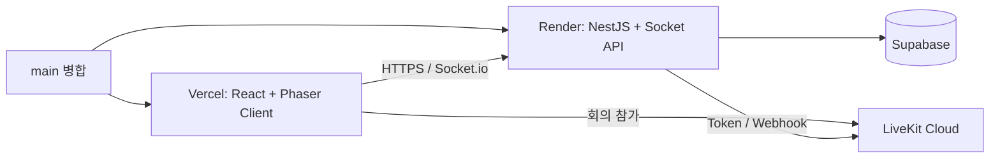

# Production Test Scenarios

> 대상: `main` 기준 Vercel Client, Render Server, Supabase, LiveKit Cloud
>
> 관련 Issue: [#61](https://github.com/LIKELION2026/LIKELION2026/issues/61)
>
> 기록 원칙: 이 문서는 **실행할 테스트**를 정의한다. 완료 여부는 하단 실행 기록에 실제 결과만 적는다.

## 1. 배포 경계



- 기능 PR은 `dev`로 병합하고, Production 확인은 `dev -> main` 릴리스 PR 이후에만 한다.
- Vercel은 Client를, Render는 API와 Socket 서버를 배포한다.
- Supabase Secret Key, LiveKit API Secret은 Render에만 둔다. URL, 토큰, Secret 값 자체는 이 문서나 Issue에 기록하지 않는다.
- `VITE_SERVER_URL`은 Vercel에서 빌드 시 번들에 포함된다. Render 공개 HTTPS URL만 넣는다.

## 2. 릴리스 전 설정 점검

| ID | 위치 | 확인 | 기대 결과 |
| --- | --- | --- | --- |
| PRE-01 | GitHub 릴리스 PR | `Typecheck`, `Build Client`, `Build Server` | 세 CI job이 성공한다. |
| PRE-02 | Vercel Production | `VITE_SERVER_URL` | Render의 `https://` 공개 URL이며 경로나 후행 슬래시가 없다. Secret 값이 없다. |
| PRE-03 | Render Production | `LIVEKIT_URL`, `LIVEKIT_API_KEY`, `LIVEKIT_API_SECRET` | 모든 값이 등록되어 있고 `LIVEKIT_URL`은 `wss://`로 시작한다. |
| PRE-04 | Render Production | `SUPABASE_URL`, `SUPABASE_SECRET_KEY` | 모든 값이 등록되어 있고 Secret Key는 Vercel에 없다. |
| PRE-05 | Render Production | `CORS_ORIGINS` | Vercel Production origin과 정확히 일치한다. 예: `https://app.example.com` |
| PRE-06 | Render Production | `OFFICE_WORKSPACE_NAME`, `PORT` | 필요하면 workspace 이름을 지정하고, `PORT`는 Render가 주입하는 값을 덮어쓰지 않는다. |
| PRE-07 | Supabase | `office_members`, `office_member_presence`, `office_todos`, `calendar_events`, `calendar_event_participants` | 테이블과 접근에 필요한 schema/RLS 정책이 배포 서버의 Secret Key 기준으로 준비되어 있다. |
| PRE-08 | LiveKit Cloud | Server URL과 API Key/Secret | 같은 LiveKit 프로젝트를 가리키며, webhook을 쓴다면 target이 Render HTTPS URL의 `/meeting/livekit/webhook`이다. |

`CORS_ORIGINS`에는 Vercel URL의 **origin만** 넣는다. `/office` 같은 path를 포함하면 브라우저 Socket/HTTP 요청이 차단될 수 있다.

## 3. 배포 직후 스모크 테스트

아래 순서는 `main` 병합 뒤 Vercel과 Render 배포가 모두 완료된 뒤 실행한다.

| ID | 수행 | 기대 결과 | 실패 시 우선 확인 |
| --- | --- | --- | --- |
| SMOKE-01 | Render `GET https://<render>/health` | `status: "ok"`, `service: "likelion2026-server"`가 응답한다. | Render Event/로그, 필수 환경변수, 포트 |
| SMOKE-02 | Vercel Production URL을 시크릿 창에서 연다. | Client shell과 게스트 온보딩 모달이 표시된다. | Vercel 배포 상태, `VITE_SERVER_URL` |
| SMOKE-02A | `/office`, `/meeting-lab` 주소를 각각 직접 열고 새로고침한다. | Vercel이 `index.html`로 rewrite해 React Router 화면을 유지하며 404를 반환하지 않는다. | 저장소 루트 `vercel.json`의 SPA rewrite, Vercel 재배포 상태 |
| SMOKE-03 | 온보딩에서 이름·국가를 입력해 오피스에 진입한다. | 아바타와 오피스 화면이 열리고 `POST /office/session`이 성공한다. | Render CORS, Supabase Key/Schema |
| SMOKE-04 | 브라우저 개발자 도구 Network에서 `/office` Socket 연결을 확인한다. | WebSocket이 연결되고 CORS/`connect_error`가 없다. | `CORS_ORIGINS`, `VITE_SERVER_URL`, Render 로그 |
| SMOKE-05 | 같은 Production URL을 새 시크릿 창에서 다시 연다. | 두 사용자 모두 오피스에 남고 입장/이동/상태 변경이 반대 창에 반영된다. | Socket namespace, Render 단일 인스턴스 상태 |

## 4. 2인 협업 E2E 시나리오

### E2E-01. 출퇴근과 Presence

1. 브라우저 A는 `Korea-PM`, 브라우저 B는 `Vietnam-Dev`로 각각 입장한다.
2. A가 출근·상태 변경·이동을 수행한다.
3. B 화면에서 A의 아바타 위치와 상태가 최신 값으로 바뀌는지 확인한다.
4. A가 퇴근하거나 탭을 닫은 뒤 B 화면에서 연결 해제/퇴근 상태가 기대한 방식으로 나타나는지 확인한다.
5. A가 같은 브라우저 프로필로 다시 접속해 기존 게스트 세션과 지정 아바타를 복구하는지 확인한다.

**성공 기준:** 상대의 온라인·오프라인과 기본 상태를 실제 화면에서 혼동 없이 파악할 수 있다.

### E2E-02. 오늘의 할 일 공유

1. A가 자신의 TODO를 추가·완료·수정한다.
2. B가 A의 아바타 또는 연결된 TODO 패널에서 공개 범위의 목록을 확인한다.
3. A가 브라우저를 새로고침한 뒤 TODO가 유지되는지 확인한다.

**성공 기준:** TODO는 작성자 세션으로 수정되고, 팀원은 진행 중인 업무 맥락을 읽을 수 있다.

### E2E-03. 공유 캘린더와 파생 상태

캘린더 UI는 디자인 확정 전 슬롯 상태다. UI가 연결되기 전에는 REST API 또는 API 클라이언트로 아래 계약을 확인한다.

1. A가 `vacation` 또는 `remote_work` 일정을 생성한다.
2. 워크스페이스 기간 조회에서 A의 일정이 조회되는지 확인한다.
3. 현재 시각과 겹치는 일정이면 `calendar-statuses`에서 A의 파생 상태가 반환되는지 확인한다.
4. A만 자신의 guest token으로 일정을 수정·삭제할 수 있는지 확인한다.
5. 같은 시간에 여러 일정이 겹치면 `vacation > absence > meeting > focus > remote_work` 우선순위가 적용되는지 확인한다.

**성공 기준:** 일정은 DB Presence 값을 영구 변경하지 않으며, 아바타·피플 목록 UI가 연결되면 파생 상태를 표현할 수 있다.

### E2E-04. LiveKit 회의

1. A와 B가 Production Client의 Meeting Lab에서 같은 `lab-<date>-<slug>` 회의방에 입장한다.
2. 두 브라우저에서 카메라·마이크 권한을 허용한다.
3. 로컬·상대 영상과 상대 오디오를 각각 확인한다.
4. 한쪽이 마이크·카메라를 끄고 켜면 미디어 상태가 올바르게 바뀌는지 확인한다.
5. 한쪽이 퇴장하면 남은 사용자 화면이 연결 해제를 올바르게 반영하는지 확인한다.

**성공 기준:** Client는 Server token API를 통해 LiveKit에 연결하며 API Key/Secret은 브라우저에 노출되지 않는다.

### E2E-05. Mock 실시간 번역 자막

1. A와 B가 같은 Meeting Lab room에 입장한다.
2. Render Server를 대상으로 `pnpm smoke:meeting-subtitle`을 실행한다. 필요하면 아래 환경변수를 사용한다.

```bash
MEETING_SUBTITLE_SMOKE_SERVER_BASE_URL="https://<render-server-url>" \
MEETING_SUBTITLE_SMOKE_ROOM_NAME="lab-likelion-<yyyymmdd>-meeting-room" \
corepack pnpm smoke:meeting-subtitle
```

3. A와 B 양쪽에서 partial 자막이 final 자막으로 교체되고, 원문·번역문·발화자·순서가 동일한지 확인한다.

**성공 기준:** 동일 room을 구독한 참가자에게만 Mock 자막이 전달되고, partial revision이 final revision으로 대체된다.

## 5. 실패 시나리오

| ID | 유도 조건 | 기대 결과 |
| --- | --- | --- |
| NEG-01 | 카메라·마이크 권한을 거부한다. | 권한 거부 이유와 재시도 가능한 상태가 보이며 화면이 멈추지 않는다. |
| NEG-02 | 잘못된 이름 또는 필수 온보딩 값을 제출한다. | 유효성 오류가 표시되고 세션이 생성되지 않는다. |
| NEG-03 | 허용하지 않은 origin에서 API/Socket을 요청한다. | Render가 CORS로 차단하며 Production Client 자체는 정상 연결을 유지한다. |
| NEG-04 | 다른 사용자의 guest token으로 TODO·일정을 수정/삭제한다. | 서버가 소유권 오류를 반환하고 원본 데이터가 변경되지 않는다. |
| NEG-05 | LiveKit URL/토큰이 잘못됐거나 네트워크가 끊긴다. | 회의 연결 실패 또는 재연결 상태가 표시되고 무한 로딩하지 않는다. |
| NEG-06 | Render 또는 Supabase가 일시적으로 실패한다. | Client가 빈 성공 상태로 보이지 않고 오류·재시도 상태를 표시한다. |

## 6. 실행 기록

릴리스마다 아래 표를 PR 댓글 또는 GitHub Discussion에 복사해 실제 결과를 기록한다. Secret, token, 전체 Request Header/Body는 붙여넣지 않는다.

| 릴리스 | 실행자 | 일시 | 환경 | 결과 | 실패 ID / 근거 링크 |
| --- | --- | --- | --- | --- | --- |
| `<main commit>` | `<name>` | `<KST>` | Production | Pass / Fail / Blocked | `<PR, 로그, 화면 링크>` |

### 최소 릴리스 통과 기준

- `PRE-01`부터 `PRE-07`까지 확인했다.
- `SMOKE-01`부터 `SMOKE-05`까지 모두 Pass다.
- `E2E-01`, `E2E-04`, `E2E-05`를 서로 다른 두 브라우저에서 Pass했다.
- 현재 UI가 존재하는 기능에 한해 `E2E-02`, `E2E-03`을 확인했다. 캘린더 패널은 UI 연결 PR에서 다시 검증한다.
- Fail 또는 Blocked 항목은 Issue로 등록하고, 배포 판단에 영향을 주는 경우 `main` 릴리스 PR에 명시한다.

## 참고 문서

- [Deployment Runbook](./deployment.md)
- [Server Local Runbook](./server-local.md)
- [Client Local Runbook](./client-local.md)
- [Realtime Meeting](../FEATURES/realtime-meeting/README.md)
- [Shared Calendar](../FEATURES/virtual-office/shared-calendar.md)
