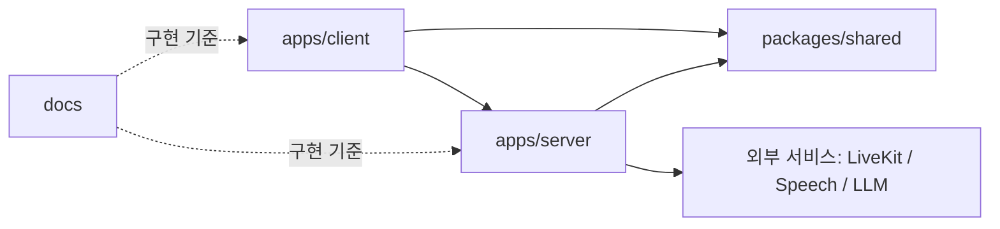

# Structure Draft

> 작성자: Project Team
>
> 작성일: 2026-08-15
>
> 마지막 업데이트: 2026-08-15
>
> 상태: 초안 - 앱 초기 세팅과 첫 기능 구현 후 조정
>
> 관련 Issue / PR / Discussion: 추후 연결

## 목적

Moyo와 같은 pnpm monorepo의 장점을 따라 Client, Server, 공통 계약을 분리한다. 이 구조는 특정 라이브러리를 중심으로 나누는 대신, 사용자 기능과 도메인 책임을 기준으로 코드를 배치한다.

현재 저장소에는 `packages/shared`와 `apps/server`의 초기 세팅이 추가되었다. 아래는 앱 구현이 진행되며 맞춰 갈 목표 구조이며, 실제 구현 범위가 생긴 폴더부터 순서대로 추가한다.

## 목표 구조

```text
.
├── apps/
│   ├── client/
│   │   ├── public/
│   │   │   └── assets/                 # 타일맵, 아바타, 아이콘 등 정적 자산
│   │   └── src/
│   │       ├── app/                    # 앱 진입점, 전역 Provider, 라우팅
│   │       ├── pages/                  # 페이지 조합
│   │       ├── widgets/                # 여러 기능을 조합한 화면 영역
│   │       ├── features/               # 사용자 기능 단위
│   │       │   ├── virtual-office/     # Phaser 씬, 아바타 이동, 공간 상호작용
│   │       │   ├── realtime-meeting/   # 회의 입장, LiveKit 화면, 자막·번역 UI
│   │       │   ├── ai-briefing/        # AI 브리핑 검토·확정·피드
│   │       │   └── team-icebreaking/   # 질문 카드·가벼운 팀 상호작용
│   │       ├── entities/               # Member, Meeting, Briefing 같은 도메인 UI 모델
│   │       └── shared/                 # API·Socket 클라이언트, 공통 UI, 유틸
│   ├── server/
│   │   └── src/
│   │       ├── modules/                # NestJS 도메인 모듈
│   │       │   ├── auth/
│   │       │   ├── team/
│   │       │   ├── presence/           # 접속·상태 동기화
│   │       │   ├── meeting/            # 회의방, 참가 권한, 자막 흐름
│   │       │   └── briefing/           # 브리핑 저장·확정
│   │       ├── integrations/           # 외부 서비스 어댑터
│   │       │   ├── livekit/
│   │       │   ├── speech/             # 음성 인식·번역 제공자
│   │       │   └── llm/                # 요약·누락 점검 제공자
│   │       ├── common/                 # Guard, Filter, Interceptor, 공통 오류 처리
│   │       ├── config/                 # 환경변수 검증과 설정 조합
│   │       ├── app.module.ts
│   │       └── main.ts
│   └── translation-pipeline/           # 한국어-베트남어 통역 파이프라인 (Python)
│       ├── data/                       # 관용구 사전 glossary.json
│       ├── src/translation_pipeline/   # 언어·참가자·사전 매칭 로직
│       └── tests/
├── packages/
│   └── shared/
│       └── src/
│           ├── contracts/              # HTTP DTO와 Socket 이벤트 Payload
│           │   ├── http/
│           │   └── socket/
│           ├── domain/                 # 공유 도메인 타입과 상태 값
│           ├── constants/              # 이벤트 이름, 언어 코드 등 상수
│           └── index.ts
├── docs/
├── .github/
├── .agents/
├── .githooks/
├── package.json
├── pnpm-workspace.yaml
└── tsconfig.base.json
```

## 의존성 방향



- Client와 Server는 서로의 내부 파일을 import하지 않는다.
- Client와 Server가 함께 이해해야 하는 DTO, Socket 이벤트 이름, 상태 값은 `packages/shared`에 둔다.
- 외부 서비스 SDK와 API 키 접근은 Server의 `integrations`와 `config`에서만 처리한다.
- `packages/shared`에는 React 컴포넌트, NestJS Service, 데이터베이스 접근 코드를 두지 않는다.

## Client 배치 기준

### `features`

사용자가 직접 경험하는 기능을 둔다. 기능 폴더는 화면, 상태, API 호출, UI를 그 기능 안에서 함께 관리할 수 있다.

| 기능 | 포함할 책임 | 초기 담당 작업 |
| --- | --- | --- |
| `virtual-office` | Phaser 씬, 아바타, 이동, 좌석·회의실 영역, 팀원 상태 표시 | Phaser 2D 가상 오피스 기본 구조 |
| `realtime-meeting` | 회의 입장·퇴장, LiveKit 영상·음성, 자막·번역 UI | LiveKit 클라이언트 연결 |
| `ai-briefing` | AI 결과 표시, 편집, 확정, 브리핑 피드 | 회의 요약 기능 이후 추가 |
| `team-icebreaking` | 질문 카드, 참여 상태, 번역 보기 | P1 이후 추가 |

`pages`는 기능을 조합만 한다. 회의 자막 로직이나 Phaser 이동 로직을 `pages`에 직접 두지 않는다.

`widgets`에는 `OfficeShell`, `MeetingPanel`처럼 여러 기능을 화면에서 연결하는 조합 UI를 둔다. 한 기능 안에서만 쓰는 UI는 해당 `features` 폴더에 둔다.

### Phaser 경계

`virtual-office` 안에서 Phaser 관련 코드를 다음 책임으로 나눈다.

```text
features/virtual-office/
├── scenes/                       # OfficeScene 등 화면·공간 단위
├── entities/                     # Avatar, Seat, MeetingRoom 등 게임 오브젝트
├── systems/                      # 이동, 충돌, Socket 상태 반영
├── ui/                           # Phaser 밖의 React 제어 UI
└── model/                        # 오피스 상태와 변환 함수
```

React는 화면 제어와 정보 패널을 담당하고, Phaser는 공간 렌더링과 공간 안 상호작용을 담당한다. 같은 상태를 두 곳에서 각각 소유하지 않는다.

## Server 배치 기준

### `modules`

도메인별 NestJS Module을 둔다. Controller와 Gateway는 요청·이벤트를 받고, Service가 도메인 로직을 처리한다.

| 모듈 | 책임 |
| --- | --- |
| `presence` | 사용자 접속, 상태 변경, Socket 동기화 |
| `meeting` | 회의방 메타데이터, LiveKit 토큰 발급, 회의 상태 |
| `briefing` | 브리핑 초안, 사용자 확정, 피드 조회 |
| `team` | 팀·멤버·권한 |
| `auth` | 사용자 인증과 인증 정보 전달 |

### `integrations`

LiveKit, 음성 인식·번역 API, LLM API처럼 교체 가능하거나 외부 네트워크를 호출하는 코드를 둔다. 도메인 Service는 특정 SDK의 세부 구현이 아니라 어댑터 인터페이스에 의존하게 유지한다.

## Shared 계약 기준

공통 계약은 구현 전 가장 먼저 합의한다. 예를 들어 아래 이벤트는 `packages/shared/src/contracts/socket`에 둔다.

```text
presence.updated
member.status.updated
meeting.requested
meeting.joined
subtitle.created
briefing.drafted
briefing.confirmed
```

계약을 바꾸면 `packages/shared` 변경, Client·Server 반영, 관련 기능 문서를 같은 작업 흐름에서 함께 확인한다.

## Python 통역 파이프라인 예외

`apps/translation-pipeline`은 이 문서의 pnpm·TypeScript 전제에서 벗어나는 유일한 패키지다. 이 문서의 변경 규칙에 따라 배치 사유와 범위를 남긴다.

- **왜 `apps/`인가**: `apps/`는 독립 실행 가능한 애플리케이션 단위이고 이 파이프라인이 정확히 그것이다. `packages/shared`는 Client와 Server가 함께 쓰는 TypeScript 계약 자리이므로 맞지 않는다.
- **왜 다른 언어인가**: Deepgram과 LLM SDK를 LiveKit 연동 전에 오디오 파일·마이크만으로 검증하기 위해서다. Python SDK 쪽 예제와 실시간 스트리밍 지원이 이 검증에 유리하다.
- **workspace 경계**: pnpm workspace에는 포함하지 않는다. 자체 `requirements.txt`와 가상환경으로 실행하므로 `pnpm install`과 루트 스크립트의 영향을 받지 않는다.
- **범위**: 검증용이다. 확정된 로직은 `apps/server/src/integrations/speech`와 `integrations/llm`으로 옮기고, 그 시점에 이 폴더의 존속 여부를 다시 판단한다.
- **의존 경계**: Client·Server·Shared 코드를 import하지 않는다. 반대로 다른 앱이 이 폴더를 import하지도 않는다.

관련 기록은 아래에 있다.

- `docs/ADR/0001-translation-provider-abstraction.md`, PR #5 — 번역 provider를 교체 가능하게 둔 이유
- `docs/ADR/0002-participant-local-translation-pipeline.md` — 파이프라인을 서버가 아니라 참가자 PC에서 돌리는 이유

## 초기 구현 순서

1. Root monorepo 설정과 `apps/client`, `apps/server`, `packages/shared` 스캐폴딩
2. Shared의 최소 도메인 타입과 Socket 이벤트 초안
3. Server의 `meeting` 모듈과 LiveKit 토큰 발급
4. Client의 `realtime-meeting` 회의방 연결
5. Client의 `virtual-office` Phaser 씬과 아바타 이동
6. Server `presence`와 Client 오피스 상태 동기화 연결
7. 자막·번역과 AI 브리핑 기능 확장

3~5번은 인터페이스를 먼저 맞추면 병렬로 진행할 수 있다. 실제 API·Socket Payload가 확정되면 `docs/FEATURES/<feature>/contracts.md`와 `packages/shared`를 함께 갱신한다.

## 변경 규칙

- 새 기능을 추가할 때는 먼저 `docs/FEATURES/<feature>/README.md`에 문제와 완료 기준을 작성한다.
- 기능 간 공통 코드가 반복될 때만 `entities` 또는 `shared`로 이동한다.
- 라이브러리 선택, 폴더 구조의 큰 변경, 공유 계약 분리는 ADR로 결정 이유를 남긴다.
- 실제 구조가 이 초안과 달라지면 코드를 억지로 맞추지 말고, 이유를 기록한 뒤 이 문서를 업데이트한다.
