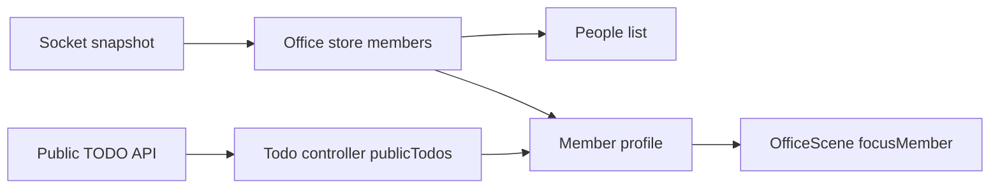

# Office People Context Design

> Related Issue: #94

## Goal

원격 팀원이 화면이나 활동량을 감시하지 않고도, 동료가 자발적으로 공개한 협업 상태와 오늘의 TODO를 오피스 안에서 확인한다.

## Scope

- 피플 목록을 열어 현재 오피스의 팀원을 확인한다.
- 팀원을 선택하면 읽기 전용 프로필 패널에서 국가, 연결 상태, 출퇴근 상태, 협업 상태, 공개 TODO를 확인한다.
- `찾아가기`는 선택한 팀원 좌표로 카메라만 이동한다.
- 본인은 타인 프로필 대신 기존 내 업무 패널 진입점으로 안내한다.

## Out Of Scope

- 타인의 TODO 수정, 비공개 TODO 조회, 업무 화면·키보드·카메라 감시
- 메시지 전송, 호출, 회의 생성
- TODO 변경 Socket 이벤트와 낙관적 갱신
- 캘린더 편집 UI와 AI 상태 추천

## Interaction

1. 사용자가 HUD의 `피플` 버튼을 누른다.
2. 패널은 Socket snapshot의 팀원 목록을 이름순으로 보여 준다.
3. 팀원을 선택하면 오른쪽 프로필 패널이 열리고, `publicTodos`에서 `memberId`가 일치하는 항목만 표시한다.
4. `찾아가기`를 누르면 Phaser 카메라가 선택한 아바타의 현재 좌표를 중심으로 이동한다. 사용자 아바타와 Socket 위치는 변경하지 않는다.
5. 목록이 비었거나 TODO API 요청이 실패하면 각각의 이유를 패널 안에 표시한다.

## Data Flow

## Component Boundary

- `people-context.ts`: 멤버 상태와 공개 TODO를 표시 모델로 변환하는 순수 함수다.
- `OfficePeoplePanel.tsx`: 목록·빈 상태·오류·프로필 렌더링과 선택 상태를 담당한다.
- `OfficeHud.tsx`: 피플 패널을 여는 HUD 명령만 제공한다.
- `OfficeScene.focusMember(x, y)`: 카메라를 선택 좌표로 이동한다.
- `VirtualOffice.tsx`: store, TODO controller, scene을 UI에 연결한다.

## Error And Privacy Rules

- 공개 TODO가 없으면 `공개한 오늘의 업무가 없습니다.`만 표시한다.
- TODO 요청 오류는 패널에서 표시하고, 피플 목록과 카메라 이동은 계속 가능하다.
- `isPublic === false` TODO는 어떤 타인 프로필에도 포함하지 않는다.
- `displayMode`이 `ghost` 또는 `sleeping`인 팀원도 목록에는 남기되 연결·퇴근 상태를 분명히 보인다.

## Verification

- 순수 표시 모델 테스트: 비공개 TODO 제외, 선택 멤버별 공개 TODO 필터, 상태 라벨 변환
- scene 테스트: 찾아가기가 플레이어 위치나 Socket 이동 콜백을 바꾸지 않고 카메라만 이동
- 수동 테스트: 두 브라우저에서 한 명이 공개 TODO 생성 후 다른 창에서 피플 목록·프로필·찾아가기를 확인
