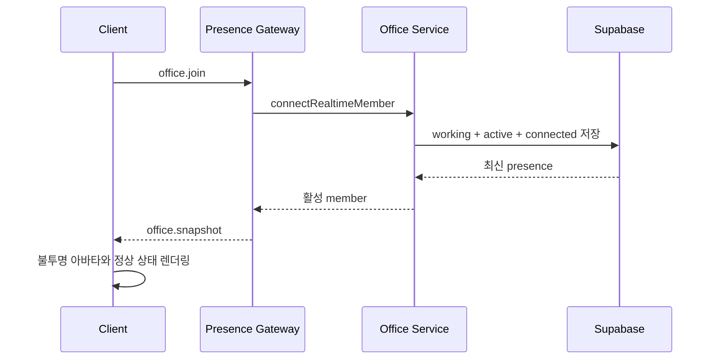

# Reconnect Presence Display Design

> Related Issue: [#90](https://github.com/LIKELION2026/LIKELION2026/issues/90)

## Goal

오피스에 접속한 사용자는 Socket 연결 상태와 아바타 표시 상태가 일치해야 한다. 재접속한 사용자를 `connected/ghost`로 남기지 않고, 화면에서 활성 아바타와 정상 상태 라벨로 표시한다.

## Confirmed Cause

`disconnectRealtimeMember()`는 연결 해제 시 `connection_status`를 `disconnected`, `display_mode`를 `ghost`로 저장한다. 반면 `connectRealtimeMember()`는 `connection_status`만 `connected`로 바꾸므로, 기존 `ghost` 값이 남는다.

Phaser의 원격 아바타 렌더링은 `display_mode=ghost`를 우선해 `연결 해제` 라벨과 낮은 투명도를 적용한다. 실제 Supabase 집계에서도 `connected/ghost` 상태가 확인됐다.

## Chosen Policy

- 오피스 Socket 연결 성공은 사용자의 오피스 재진입으로 본다.
- 재진입 시 `attendance_status=working`, `display_mode=active`로 자동 출근 처리한다.
- 사용자가 `퇴근하기`를 누르면 기존처럼 `checked_out/sleeping`으로 전환한다.
- 실제 Socket 연결 해제 시에만 `disconnected/ghost`로 전환한다.

## Data Flow

## Scope

### In Scope

- `connectRealtimeMember()`의 출석·표시·연결 상태를 한 번에 활성화
- 해당 상태 전이를 검증하는 OfficeService 단위 테스트
- 실제 Supabase 상태와 일반/시크릿 브라우저 재접속 검증 기록

### Out of Scope

- `gray-cat.webp` 적용: 현재 `6 x 4`, 프레임 `256 x 256` 스프라이트 규격이 아니므로 별도 에셋 작업으로 분리
- 출석 버튼 UI 변경
- ghost, sleeping, vacation 표시 스타일 변경
- Socket 재연결 정책 외의 presence 리팩터링

## Acceptance Criteria

1. 같은 guest token으로 오피스에 재접속하면 DB 상태가 `working/active/connected`다.
2. 원격 화면에서 해당 아바타는 반투명하지 않고 `연결 해제` 라벨이 없다.
3. `퇴근하기`를 누르면 기존 `checked_out/sleeping` 동작을 유지한다.
4. Socket 연결이 끊길 때만 `disconnected/ghost`가 저장된다.
